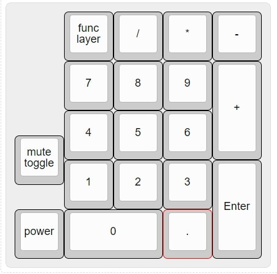
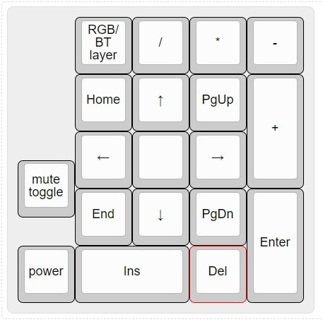
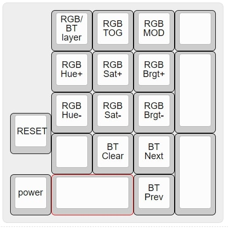

# ZMK Firmware adapted for the doodboard duckpad running on the nice!nano

 

Last Updated: 25 Dec 2020

Credit for the ZMK Firmware to [The ZMK Contributors](https://zmkfirmware.dev/)

Hardware credit for the duckboard to 

Hardware credit for the nice!nano to Nicell of 

Join the [ZMK Discord Server](https://zmkfirmware.dev/community/discord/invite) and the [doodboard Discord Server](https://discord.gg/UCEnxWk)

Default Layout:

**Layer 0 (Default)**

**Layer 1 (Navigation)**

**Layer 2 (RGB and BT)**

