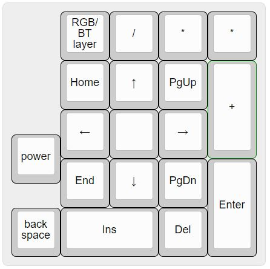
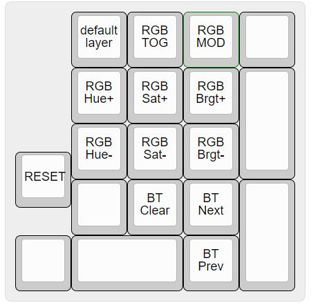

## ZMK Firmware adapted for duckboard/nice!nano combo

Last Updated: 1 Jan 2021

**_warning:_** this is beta firmware, some features may have bugs

Please message me on [discord](https://discord.gg/K3SJrtN5PJ) if you find any bugs

Credit for the ZMK Firmware to [The ZMK Contributors](https://zmkfirmware.dev/)  
Hardware credit for the duckboard to [doodboard](https://doodboard.xyz/)  
Hardware credit for the nice!nano to Nicell of [nice keyboards](https://nicekeyboards.com/)  

Join the [ZMK Discord Server](https://zmkfirmware.dev/community/discord/invite) and the [doodboard Discord Server](https://discord.gg/UCEnxWk)

Flashing Instructions:
* download the duckboard.uf2 file
* connect the nice!nano to your computer and put it in bootloader (short gnd+rst twice)
* the nano should appear as a storage device on your computer once in bootloader mode
* drag the duck.uf2 file into the nano storage and it should flash automatically

further flashing instructions in the [nice!nano docs](https://docs.nicekeyboards.com/#/nice!nano/getting_started?id=flashing-firmware-and-bootloaders) 

*Default Layout:*

| Layer 0 (Default) | Layer 1 (Function) | Layer 2 (RGB and BT) |
  ------  | ------ | ------
  |  | 
