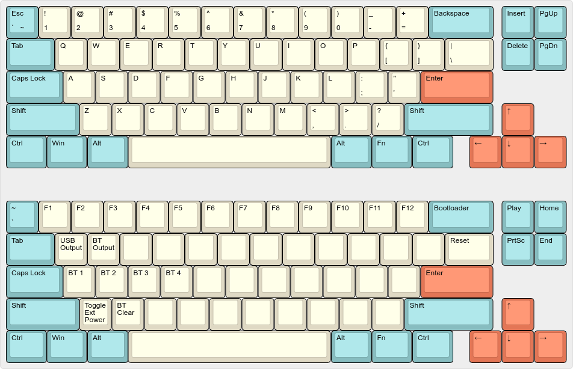

# [MF68](https://www.40percent.club/2016/11/mf68-revised-pcb.html)

Replacement MagicForce 68 PCB designed by [di0ib](https://github.com/di0ib).  
Hardware repo: https://github.com/di0ib/tmk_keyboard/tree/master/keyboard/mf68  

## Features

- Designed for Pro Micro boards
- PWM backlight control (with optional FDS6630A, not configured)
- Mini USB footprint for DIY case, pads for the original MagicForce 68 daughter board

## Default layout

## Use with an Adafruit Feather nRF52840 Express

Build with `west build -p -d build/feather -b adafruit_feather_nrf52840 -- -DSHIELD=mf68_feather`.

### Pinout

| Pro Micro Left | Feather Left | Feather Right | Pro Micro Right |
|----------------|--------------|---------------|-----------------|
| D3             | A2           |               | RAW             |
| D2             | A3           | GND*          | GND             |
| GND            |              | RST*          | RESET           |
| GND            |              |               | VCC             |
| D1             | A4           | D5            | F4              |
| D0             | A5           | D6            | F5              |
| D4             | SCK          | D9            | F6              |
| C6             | MO           | D10           | F7              |
| D7             | MI           | D11           | B1              |
| E6             | RX           | D12           | B3              |
| B4             | TX           | D13           | B2              |
| B5             |              | A0            | B6              |

### But why not a Pro Micro-compatible microcontroller?
Availability and sometimes cost. Sometimes it's hard to find them or the developers straight up stop producing them, sad but common in the mechanical keyboards community. On the other hand, the Feather nRF52840 Express is more widely available and I doubt it's gonna be discontinued anytime soon.

I was unable to use the D2 pin, and using the SDA pin caused issues.  
In the board definitions, UART is disabled since the RX and TX pins are used for the matrix, same for SPI and SCK/MO/MI pins.  
SCL and SDA pins are available for I2C but disabled by default, uncomment lines 84-91 in `app/boards/arm/adafruit_feather_nrf52840/adafruit_feather_nrf52840.dts` to enable.  
The QSPI flash is disabled too, if needed uncomment lines 103-125 in the same file.  

The space inside the MagicForce68 case is very, very limited, and physical modifications to the case, like the removal of inner support, are necessary; I also had to desolder the JST connector and remove the black holder from the SWD connector from the Feather, basically making it flat. For the same reason, forget about putting a battery inside: best case scenario it just doesn't fit, worst case scenario it gets punctured by the solder joints (which is as bad as it sounds). I'm gonna try with a 18650 battery on the outside.  

If adding backlight to your board with this controller, remember that Adafruit says that it's not safe to pull 500mA from the regulator when connected to 5V (read: USB).