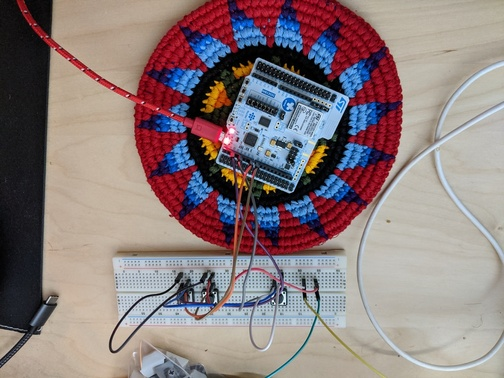
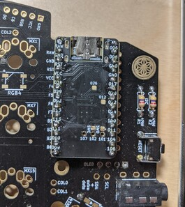

Two years ago, today, I minted the first ever commit for ZMK:

```
commit 85c8be89dea8f7a00e8efb06d38e2b32f3459935
Author: Pete Johanson <peter@peterjohanson.com>
Date:   Tue Apr 21 16:20:34 2020 -0400

    Initial work.

 .gitignore     |  1 +
 .gitmodules    |  3 +++
 CMakeLists.txt | 40 +++++++++++++++++++++++++++++++++++++++
 src/main.c     | 60 ++++++++++++++++++++++++++++++++++++++++++++++++++++++++++
 src/zmk_lib.h  |  7 +++++++
 zephyr-rust    |  1 +
 6 files changed, 112 insertions(+)
```

I will never forget that commit. Not because of the code it contained (please don't look, it's not worth it!), but for what it started.

Working on ZMK has given me the opportunity to reconnect with old friends ([@brixmeister](https://twitter.com/brixmeister) was my Gentoo mentor/sponsor when I became a contributor there on my first ever OSS project, and is a current active Zephyr RTOS contributor!), make new ones, and learn so much from the amazing mechanical keyboard community.

## First Keyboard

But I'm getting ahead of myself! Back to early ZMK. I present you the first ZMK keyboard:



That first "keyboard" taught me a _lot_. It forced me to dust off my long forgotten, rudimentary electronics knowledge, and gave me my first taste of really combining the physical/tangible with code in a way that years of doing backend API development never had.

I was _hooked_.

## Zephyr RTOS

Early in my brainstorming, I knew I needed a foundation to build upon that would get me "a lot for free." I evaluated several different real-time operating systems (RTOSes) and happened upon [Zephyr](https://zephyrproject.org/). It immediately ticked all the boxes I wanted:

- Robust, open source Bluetooth stack, supporting multiple SoCs. At the time, I was trying out stm32wb thanks to some interest among keyboard designers, but I also so there were other compelling choices that might be a good fit.
- An open source, non-copyleft license. I am a firm believer in F/OSS, and wanted to use a license that was as unrestricted as possible.
- Had a lot of core APIs available, so I could focus on the keyboard functionality, not the plumbing. I love tinkering, but I wanted to focus my time on the interesting bits, not infrastructure.

I'm really happy with the choice, it has served us incredibly well the past two years.

## Real Keyboard

At some point, somehow, [innovaker] introduced me to [nicell] who graciously sent me a few of the early pre-production nice!nano controllers, which I was able to get running on my Kyria. Doing so required the first split code, as well as lots of general improvements.



The day I was finally able to type on a wireless, split keyboard running ZMK was deeply momentous for me!

## Onward and Upward

We've come a long way since then, with our [supported hardware](/docs/hardware), [features](/docs/features/keymaps) and [behaviors](/docs/behaviors/key-press) growing regularly.

ZMK powered keyboards are now available in group buys and in stock at various vendors; compatible controllers have been used in a wide range of builds to empower our users to free themselves from their USB/TRRS cables and move about untethered.

This progress is only possible thanks to all of the contributors who've joined me in the vision for a wireless-first world. I am so grateful for everyone who has given their time to contribute code, answer questions on our Discord server, write more documentation, and especially all the users who have trusted us to make their input devices work.

I can't wait to see what we can accomplish together in the next two years.

[innovaker]: https://github.com/innovaker
[nicell]: https://github.com/Nicell
