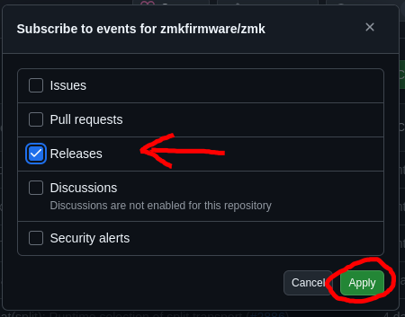

ZMK is preparing for a big breaking change. As such, users should consider pinning their ZMK version. Read on to find out more about our versioning system and how you can pin your ZMK version.

<!-- truncate -->

## ZMK Versioning -- The 'what' and the 'why'

Around 6 months ago, ZMK began using versioning. Prior to this point, all ZMK users ran their firmware off of `main`. This meant that users would always get the latest and greatest changes whenever they built new firmware, but on occasion there would be breaking changes in `main` that resulted in user confusion.

Avoiding this user confusion became a limiting factor when it came to making changes. [Zephyr](https://www.zephyrproject.org/), the RTOS that ZMK is based off of, made some breaking changes in version 3.6. Hence ZMK has been stuck on Zephyr 3.5 for over 1.5 years, while Zephyr has already moved on to version 4.1. Asking when ZMK will upgrade is a frequent question we get asked, as the new version comes with plenty of improvements and drivers for newer, exciting hardware.

With versioning now in place, users can pin their ZMK configuration to a particular version. This prevents sudden breaking changes from happening without user opt-in and frees ZMK contributors to make breaking changes more frequently, as is necessary.

### ZMK's Versioning System

ZMK follows the [Semantic Versioning](https://semver.org/) standard. Versions are `vX.Y.Z`. ZMK uses release branches and tags: Every major or minor version bump, a new branch and tag are created. The tag points to the latest patch version. For example, when releasing `v0.2.0` the branch `v0.2-branch` and tag `v0.2` were created. When patches are made, such as for `v0.2.1`, the branch and tag are updated to point to `v0.2.1` instead of `v0.2.0`. This way, users can receive non-breaking security and bug fixes without needing to bump their version.

Whenever ZMK releases a major version with breaking changes, a proper changelog will be provided detailing the major changes from the previous version, along with clear instructions on how to upgrade and fix any breaking changes.

## To Pin or Not To Pin

For casual users of ZMK, pinning your version is recommended. Unpinned ZMK configurations are mainly suitable for those more heavily involved or interested in ZMK development. Moving forward, if you are on the `main` branch of ZMK you will be considered a (highly valued) tester, rather than a user.

To ensure that you still update your ZMK version regularly and get the latest and greatest features that interest you, I would recommend setting up notifications about new releases. You can do so on the [GitHub repository](https://github.com/zmkfirmware/zmk):




## How To Pin Your ZMK Version

:::info
If you created your ZMK config on or after `2025-07-03`, then you are already pinned to what was the most recent ZMK version at the time of creation.
:::

To pin your ZMK version, you need to edit two files:

### West Manifest

You need to edit the `config/west.yml` file in your `zmk-config` repository. The `config` folder also contains your keymaps, and is located next to the `build.yaml` file defining which keyboards are built in the first place.

Your `west.yml` should look something like this (example without [modules](/docs/features/modules) shown for simplicity):

```yaml {8} showLineNumbers
manifest:
  remotes:
    - name: zmkfirmware
      url-base: https://github.com/zmkfirmware
  projects:
    - name: zmk
      remote: zmkfirmware
      revision: main
      import: app/west.yml
  self:
    path: config
```

Simply edit the line `revision` to point to the release tag instead of `main`. At the time of writing, the latest release is `v0.2`, making your `west.yml` look something like this:

```yaml {8} showLineNumbers
manifest:
  remotes:
    - name: zmkfirmware
      url-base: https://github.com/zmkfirmware
  projects:
    - name: zmk
      remote: zmkfirmware
      revision: v0.2
      import: app/west.yml
  self:
    path: config
```

See that `main` has changed to `v0.2` on the 8th line.

### GitHub Action

You need to edit `.github/workflows/build.yml` in your `zmk-config`. Again, we are simply replacing `main` with the latest release tag (`v0.2` at time of writing):

```yaml {6} showLineNumbers
name: Build ZMK firmware
on: [push, pull_request, workflow_dispatch]

jobs:
  build:
    uses: zmkfirmware/zmk/.github/workflows/build-user-config.yml@main
```

Your file's contents should look identical to the above. Replace with the below:

```yaml {6} showLineNumbers
name: Build ZMK firmware
on: [push, pull_request, workflow_dispatch]

jobs:
  build:
    uses: zmkfirmware/zmk/.github/workflows/build-user-config.yml@v0.2
```

The change occurred on the last line.

### Version Bumping

If in the future you wish to upgrade your ZMK's version, simply change the tag in both of these files. For example, change from `v0.1` to `v0.2`.

[nmunnich]: https://github.com/nmunnich
