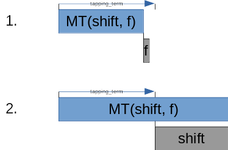
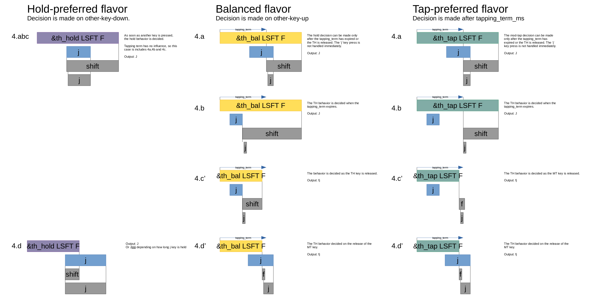

## Summary

Hold-tap is the basis for other behaviors such as layer-tap and mod-tap.

Simply put, the hold-tap key will output the 'hold' behavior if it's held for a while, and output the 'tap' behavior when it's tapped quickly.

### Hold-Tap

The graph below shows how the hold-tap decides between a 'tap' and a 'hold'.



By default, the hold-tap is configured to also select the 'hold' functionality if another key is tapped while it's active:


We call this the 'hold-preferred' flavor of hold-taps. While this flavor may work very well for a ctrl/escape key, it's not very well suited for home-row mods or layer-taps. That's why there are two more flavors to choose from: 'tap-preferred' and 'balanced'.

#### Flavors

- The 'hold-preferred' flavor triggers the hold behavior when the `tapping-term-ms` has expired or another key is pressed.
- The 'balanced' flavor will trigger the hold behavior when the `tapping-term-ms` has expired or another key is pressed and released.
- The 'tap-preferred' flavor triggers the hold behavior when the `tapping-term-ms` has expired. It triggers the tap behavior when another key is pressed.

When the hold-tap key is released and the hold behavior has not been triggered, the tap behavior will trigger.



### Basic usage

For basic usage, please see [mod-tap](mod-tap.md) and [layer-tap](layers.md) pages.

### Advanced Configuration

#### `tapping-term-ms`

Defines how long a key must be pressed to trigger Hold behavior.

#### `quick_tap_ms`

If you press a tapped hold-tap again within `quick_tap_ms` milliseconds, it will always trigger the tap behavior. This is useful for things like a backspace, where a quick tap+hold holds backspace pressed. Set this to a negative value to disable. The default is -1 (disabled).

In QMK, unlike ZMK, this functionality is enabled by default, and you turn it off using `TAPPING_FORCE_HOLD`.

#### `retro-tap`

If retro tap is enabled, the tap behavior is triggered when releasing the hold-tap key if no other key was pressed in the meantime.

For example, if you press `&mt LEFT_SHIFT A` and then release it without pressing another key, it will output `a`.

```
&mt {
	retro-tap;
};
```

#### Home row mods

This example configures a hold-tap that works well for homerow mods:

```
#include <behaviors.dtsi>
#include <dt-bindings/zmk/keys.h>

/ {
	behaviors {
		hm: homerow_mods {
			compatible = "zmk,behavior-hold-tap";
			label = "HOMEROW_MODS";
			#binding-cells = <2>;
			tapping-term-ms = <150>;
			quick_tap_ms = <0>;
			flavor = "tap-preferred";
			bindings = <&kp>, <&kp>;
		};
	};

	keymap {
		compatible = "zmk,keymap";

		default_layer {
			bindings = <
	            &hm LCTRL A &hm LGUI S &hm LALT D &hm LSHIFT F
			>;
		};
	};
};

```

If this config does not work for you, try the flavor "balanced" with a medium `tapping-term-ms` such as 200ms.

#### Comparison to QMK

The hold-preferred flavor works similar to the `HOLD_ON_OTHER_KEY_PRESS` setting in QMK. The 'balanced' flavor is similar to the `PERMISSIVE_HOLD` setting, and the `tap-preferred` flavor is similar to `IGNORE_MOD_TAP_INTERRUPT`.
