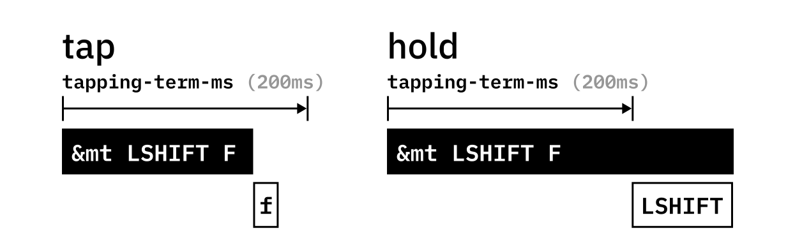

import Tabs from "@theme/Tabs";
import TabItem from "@theme/TabItem";

## Summary

Hold-tap is the basis for other behaviors such as layer-tap and mod-tap.

Simply put, the hold-tap key will output the 'hold' behavior if it's held for a while, and output the 'tap' behavior when it's tapped quickly.

### Hold-Tap

The graph below shows how the hold-tap decides between a 'tap' and a 'hold'.



By default, the hold-tap is configured to also select the 'hold' functionality if another key is tapped while it's active:


We call this the 'hold-preferred' flavor of hold-taps. While this flavor may work very well for a ctrl/escape key, it's not very well suited for home-row mods or layer-taps. That's why there are two more flavors to choose from: 'tap-preferred' and 'balanced'.

#### Flavors

- The 'hold-preferred' flavor triggers the hold behavior when the `tapping-term-ms` has expired or another key is pressed.
- The 'balanced' flavor will trigger the hold behavior when the `tapping-term-ms` has expired or another key is pressed and released.
- The 'tap-preferred' flavor triggers the hold behavior when the `tapping-term-ms` has expired. Pressing another key within `tapping-term-ms` does not affect the decision.
- The 'tap-unless-interrupted' flavor triggers a hold behavior only when another key is pressed before `tapping-term-ms` has expired. It triggers the tap behavior in all other situations.

When the hold-tap key is released and the hold behavior has not been triggered, the tap behavior will trigger.


### Basic Usage

For basic usage, please see the [mod-tap](mod-tap.md) and [layer-tap](layers.md#layer-tap) pages.

### Advanced Configuration

#### `tapping-term-ms`

Defines how long a key must be pressed to trigger Hold behavior.

#### `quick-tap-ms`

If you press a tapped hold-tap again within `quick-tap-ms` milliseconds of the first press, it will always trigger the tap behavior. This is useful for things like a backspace, where a quick tap+hold holds backspace pressed. Set this to a negative value to disable. The default is -1 (disabled).

#### `require-prior-idle-ms`

`require-prior-idle-ms` is like `quick-tap-ms` however it will apply for _any_ non-modifier key pressed before it. This effectively disables the hold-tap when typing quickly, which can be quite useful for homerow mods. It can also have the effect of removing the input delay when typing quickly.

For example, the following hold-tap configuration enables `require-prior-idle-ms` with a 125 millisecond term, alongside `quick-tap-ms` with a 200 millisecond term.

```dts
rpi: require_prior_idle {
    compatible = "zmk,behavior-hold-tap";
    #binding-cells = <2>;
    flavor = "tap-preferred";
    tapping-term-ms = <200>;
    quick-tap-ms = <200>;
    require-prior-idle-ms = <125>;
    bindings = <&kp>, <&kp>;
};
```

If you press `&kp A` and then `&rpi LEFT_SHIFT B` **within** 125 ms, then `ab` will be output. Importantly, `b` will be output immediately since it was within the `require-prior-idle-ms`, without waiting for a timeout or an interrupting key. In other words, the `&rpi LEFT_SHIFT B` binding will only have its underlying hold-tap behavior if it is pressed 125 ms **after** the previous key press; otherwise it will act like `&kp B`.

Note that the greater the value of `require-prior-idle-ms` is, the harder it will be to invoke the hold behavior, making this feature less applicable for use-cases like capitalizing letters while typing normally. However, if the hold behavior isn't used during fast typing, then it can be an effective way to mitigate misfires.

#### `retro-tap`

If `retro-tap` is enabled, the tap behavior is triggered when releasing the hold-tap key if no other key was pressed in the meantime.

For example, if you press `&mt LEFT_SHIFT A` and then release it without pressing another key, it will output `a`.

```dts
&mt {
    retro-tap;
};
```

#### `hold-while-undecided`

If enabled, the hold behavior will immediately be held on hold-tap press, and will release before the behavior is sent in the event the hold-tap resolves into a tap. With most modifiers this will not affect typing, and is useful for using modifiers with the mouse.

:::info[Alt/Win/Cmd behavior]
In some applications/desktop environments, pressing Alt keycodes by itself will have its own behavior like activate a menu and Gui keycodes will bring up the start menu or an application launcher.
:::

#### `hold-while-undecided-linger`

If your tap behavior activates the same modifier as the hold behavior, and you want to avoid a double tap when transitioning from the hold to the tap, you can use `hold-while-undecided-linger`. When enabled, the hold behavior will continue to be held until _after_ the tap behavior is released. For example, if the hold is `&kp LGUI` and the tap is `&sk LGUI`, then with `hold-while-undecided-linger` enabled, the host will see `LGUI` held down continuously until the sticky key is finished, instead of seeing a release and press when transitioning from hold to sticky key.

#### Positional hold-tap and `hold-trigger-key-positions`

Including `hold-trigger-key-positions` in your hold-tap definition turns on the positional hold-tap feature. With positional hold-tap enabled, if you press any key **NOT** listed in `hold-trigger-key-positions` before `tapping-term-ms` expires, it will produce a tap.

In all other situations, positional hold-tap will not modify the behavior of your hold-tap. Positional hold-tap is useful when used with home-row modifiers: for example, if you have a home-row modifier key in the left hand, by including only key positions from the right hand in `hold-trigger-key-positions`, you will only get hold behaviors during cross-hand key combinations.

:::info
Note that `hold-trigger-key-positions` is an array of key position indexes. Key positions are numbered sequentially according to your keymap, starting with 0. So if the first key in your keymap is Q, this key is in position 0. The next key (probably W) will be in position 1, et cetera.
:::

See the following example, which uses a hold-tap behavior definition, configured with the `hold-preferred` flavor, and with positional hold-tap enabled:

```dts
#include <dt-bindings/zmk/keys.h>
#include <behaviors.dtsi>

/ {
    behaviors {
        pht: positional_hold_tap {
            compatible = "zmk,behavior-hold-tap";
            #binding-cells = <2>;
            flavor = "hold-preferred";
            tapping-term-ms = <400>;
            quick-tap-ms = <200>;
            bindings = <&kp>, <&kp>;
            hold-trigger-key-positions = <1>;    // <---[[the W key]]
        };
    };
    keymap {
        compatible = "zmk,keymap";
        default_layer {
            bindings = <
                //  position 0         position 1       position 2
                &pht LEFT_SHIFT Q        &kp W            &kp E
            >;
        };
    };
};
```

- The sequence `(pht_down, E_down, E_up, pht_up)` produces `qe`. The normal hold behavior (LEFT_SHIFT) **IS** modified into a tap behavior (Q) by positional hold-tap because the first key pressed after the hold-tap key is the `E key`, which is in position 2, which **is NOT** included in `hold-trigger-key-positions`.
- The sequence `(pht_down, W_down, W_up, pht_up)` produces `W`. The normal hold behavior (LEFT_SHIFT) **is NOT** modified into a tap behavior (Q) by positional hold-tap because the first key pressed after the hold-tap key is the `W key`, which is in position 1, which **IS** included in `hold-trigger-key-positions`.
- If the `LEFT_SHIFT / Q key` is held by itself for longer than `tapping-term-ms`, a hold behavior is produced. This is because positional hold-tap only modifies the behavior of a hold-tap if another key is pressed before the `tapping-term-ms` period expires.

By default, `hold-trigger-key-positions` are evaluated upon the first _key press_ after
the hold-tap. For homerow mods, this is not always ideal, because it prevents combining multiple modifiers unless they are included in `hold-trigger-key-positions`. To overwrite this behavior, one can set `hold-trigger-on-release`. If set to true, the evaluation of `hold-trigger-key-positions` gets delayed until _key release_. This allows combining multiple modifiers when the next key is _held_, while still deciding the hold-tap in favor of a tap when the next key is _tapped_.

#### Using different behavior types with hold-taps

You can create instances of hold-taps invoking most [behavior types](../features/keymaps.mdx#behaviors) for hold or tap actions, by referencing their node labels in the `bindings` value.
The two parameters that are passed to the hold-tap in your keymap will be forwarded to the referred behaviors, first one to the hold behavior and second one to the tap.

If you use behaviors that accept no parameters such as [mod-morphs](mod-morph.md) or [macros](macros.md), you can pass a dummy parameter value such as `0` to the hold-tap when you use it in your keymap.
For instance, a hold-tap with node label `caps` and `bindings = <&kp>, <&caps_word>;` can be used in the keymap as below to send the caps lock keycode on hold and invoke the [caps word behavior](caps-word.md) on tap:

```dts
&caps CAPS 0
```

:::info
You cannot use behaviors that expect more than one parameter such as [`&bt`](bluetooth.md) and [`&rgb_ug`](underglow.md) with hold-taps, due to the limitations of the [devicetree keymap format](../config/index.md#devicetree-files).
One workaround is to create a [macro](macros.md) that invokes those behaviors and use the macro as the hold or tap action.
:::

### Example Use-Cases

<Tabs
defaultValue="homerow_mods"
values={[
{label: 'Homerow Mods', value: 'homerow_mods'},
{label: 'Autoshift', value: 'autoshift'},
{label: 'Toggle-on-Tap, Momentary-on-Hold Layers', value: 'mo_tog'},
]}>

<TabItem value="homerow_mods">

The following are suggested hold-tap configurations that work well with home row mods:

##### Option 1: cross-hand only modifiers, using `tap-unless-interrupted` and positional hold-tap (`hold-trigger-key-positions`)

```dts title="Homerow Mods: Cross-hand Example"
#include <dt-bindings/zmk/keys.h>
#include <behaviors.dtsi>

/ {
    behaviors {
        lh_pht: left_positional_hold_tap {
            compatible = "zmk,behavior-hold-tap";
            #binding-cells = <2>;
            flavor = "tap-unless-interrupted";
            tapping-term-ms = <100>;                        // <---[[produces tap if held longer than tapping-term-ms]]
            quick-tap-ms = <200>;
            bindings = <&kp>, <&kp>;
            hold-trigger-key-positions = <5 6 7 8 9 10>;    // <---[[right-hand keys]]
        };
    };

    keymap {
        compatible = "zmk,keymap";
        default_layer {
            bindings = <
                // position 0     pos 1             pos 2             pos 3             pos 4    pos 5    pos 6    pos 7    pos 8    pos 9    pos 10
                &lh_pht LSFT A    &lh_pht LGUI S    &lh_pht LALT D    &lh_pht LCTL F    &kp G    &kp H    &kp I    &kp J    &kp K    &kp L    &kp SEMI
            >;
        };
    };
};
```

##### Option 2: `tap-preferred`

```dts title="Homerow Mods: Tap-Preferred Example"
#include <behaviors.dtsi>
#include <dt-bindings/zmk/keys.h>

/ {
    behaviors {
        hm: homerow_mods {
            compatible = "zmk,behavior-hold-tap";
            #binding-cells = <2>;
            tapping-term-ms = <150>;
            quick-tap-ms = <0>;
            flavor = "tap-preferred";
            bindings = <&kp>, <&kp>;
        };
    };

    keymap {
        compatible = "zmk,keymap";
        default_layer {
            bindings = <
                &hm LCTRL A &hm LGUI S &hm LALT D &hm LSHIFT F
            >;
        };
    };
};
```

##### Option 3: `balanced`

```dts title="Homerow Mods: Balanced Example"
#include <behaviors.dtsi>
#include <dt-bindings/zmk/keys.h>

/ {
    behaviors {
        bhm: balanced_homerow_mods {
            compatible = "zmk,behavior-hold-tap";
            #binding-cells = <2>;
            tapping-term-ms = <200>;    // <---[[moderate duration]]
            quick-tap-ms = <0>;
            flavor = "balanced";
            bindings = <&kp>, <&kp>;
        };
    };

    keymap {
        compatible = "zmk,keymap";
        default_layer {
            bindings = <
                &bhm LCTRL A &bhm LGUI S &bhm LALT D &bhm LSHIFT F
            >;
        };
    };
};
```

</TabItem>

<TabItem value="autoshift">

A popular method of implementing Autoshift in ZMK involves a C-preprocessor macro, commonly defined as `AS(keycode)`. This macro applies the `LSHIFT` modifier to the specified `keycode` when `AS(keycode)` is held, and simply performs a [keypress](key-press.md), `&kp keycode`, when the `AS(keycode)` binding is tapped. This simplifies the use of Autoshift in a keymap, as the complete hold-tap bindings for each desired Autoshift key, as in `&as LS(<keycode 1>) <keycode 1> &as LS(<keycode 2>) <keycode 2> ... &as LS(<keycode n>) <keycode n>`, can be quite cumbersome to use when applied to a large portion of the keymap.

```dts title="Hold-Tap Example: Autoshift"
#include <dt-bindings/zmk/keys.h>
#include <behaviors.dtsi>

#define AS(keycode) &as LS(keycode) keycode     // Autoshift Macro

/ {
    behaviors {
        as: auto_shift {
            compatible = "zmk,behavior-hold-tap";
            #binding-cells = <2>;
            tapping_term_ms = <135>;
            quick_tap_ms = <0>;
            flavor = "tap-preferred";
            bindings = <&kp>, <&kp>;
        };
    };

    keymap {
        compatible = "zmk,keymap";
        default_layer {
            bindings = <
                AS(Q) AS(W) AS(E) AS(R) AS(T) AS(Y) // Autoshift applied for QWERTY keys
            >;
        };
    };
};
```

</TabItem>

<TabItem value="mo_tog">

This hold-tap example implements a [momentary-layer](layers.md#momentary-layer) when the keybind is held and a [toggle-layer](layers.md#toggle-layer) when it is tapped. Similar to the Autoshift and Sticky Hold use-cases, a `MO_TOG(layer)` macro is defined such that the `&mo` and `&tog` behaviors can target a single layer.

```dts title="Hold-Tap Example: Momentary layer on Hold, Toggle layer on Tap"
#include <dt-bindings/zmk/keys.h>
#include <behaviors.dtsi>

#define MO_TOG(layer) &mo_tog layer layer   // Macro to apply momentary-layer-on-hold/toggle-layer-on-tap to a specific layer

/ {
    behaviors {
        mo_tog: behavior_mo_tog {
            compatible = "zmk,behavior-hold-tap";
            #binding-cells = <2>;
            flavor = "hold-preferred";
            tapping-term-ms = <200>;
            bindings = <&mo>, <&tog>;
        };
    };

    keymap {
        compatible = "zmk,keymap";
        default_layer {
            bindings = <
                &mo_tog 2 1     // &mo 2 on hold, &tog 1 on tap
                MO_TOG(3)       // &mo 3 on hold, &tog 3 on tap
            >;
        };
    };
};
```

</TabItem>

</Tabs>

### Comparison to QMK

The `hold-preferred` flavor works similar to the `HOLD_ON_OTHER_KEY_PRESS` setting in QMK. The `balanced` flavor is similar to the `PERMISSIVE_HOLD` setting, and the `tap-preferred` flavor is the QMK default.
