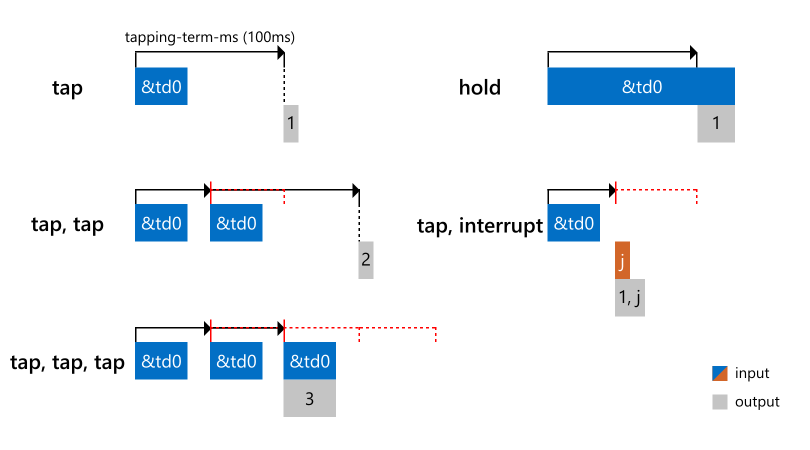

## Summary

A tap-dance key invokes a different behavior (e.g. `kp`) corresponding
to how many times it is pressed. For example, you could configure a
tap-dance key that acts as `LSHIFT` if tapped once, or Caps _Lock_ if tapped twice.
The expandability of the number of [`bindings`](#bindings) attached to a
particular tap-dance is a great way to add more functionality to a single key,
especially for keyboards with a limited number of keys.
Tap-dances are completely custom, so for every unique tap-dance key,
a new tap-dance must be defined in your keymap's `behaviors`.

Tap-dances are designed to resolve immediately when interrupted by another keypress.
Meaning, when a keybind is pressed other than any active tap-dances,
the tap-dance will activate according to the current value of its
counter before the interrupting keybind is registered.

### Configuration

#### `tapping-term-ms`

Defines the maximum elapsed time after the last tap-dance keybind press
before a binding is selected from [`bindings`](#bindings).
Default value is `200`ms.

#### `bindings`

An array of one or more keybinds. This list can include [any ZMK keycode](../codes/) and bindings for ZMK behaviors.

#### Example Usage

This example configures a tap-dance named `td0` that outputs the number of times it is pressed from 1-3.

```
#include <behaviors.dtsi>
#include <dt-bindings/zmk/keys.h>

/ {
	behaviors {
		td0: tap_dance_0 {
            compatible = "zmk,behavior-tap-dance";
            label = "TAP_DANCE_0";
            #binding-cells = <0>;
            tapping-term-ms = <200>;
            bindings = <&kp N1>, <&kp N2>, <&kp N3>;
        };
	};

	keymap {
		compatible = "zmk,keymap";

		default_layer {
			bindings = <
	            &td0
			>;
		};
	};
};
```

The following image describes the behavior of this particular tap-dance.



:::note
Alphanumeric [`key press`](key-press.md) bindings, like those used for `td0`,
will release as soon as an interrupting key press occurs.
For instance, if a modifier key like `LSHIFT` were to replace the `N1`
binding in the last example above, it would remain pressed until `td0`'s
binding is released and the output would instead be `J`. Any following
alphanumeric key presses would be capitalized as long as `td0` is held down.
:::
