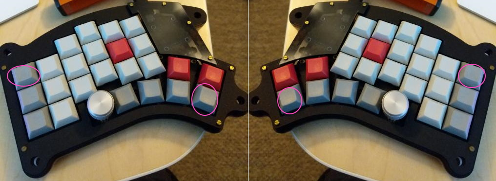
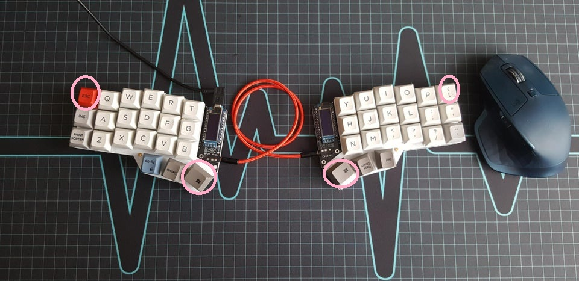
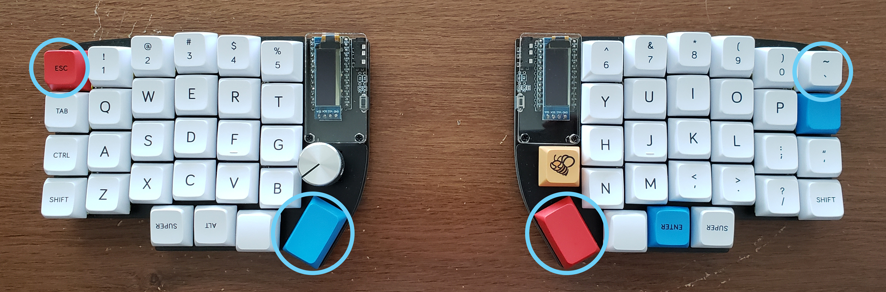

Known as a 'bond reset', each keyboard has a special key combination independent of the user defined key map which will
clear all wireless connection configurations. The keys must be held for 3 to 5 seconds after the device is
reset.

:::warning
Currently, ZMK only supports a single BLE host. If you remove the keyboard from the host's bluetooth devices
list, you will need to clear the bonds.
:::

## Split Keyboards

Split keyboards will need to be cleared on both halves. For best results try to reset them at the same time.

### Kyria

### Corne

### Lily58

