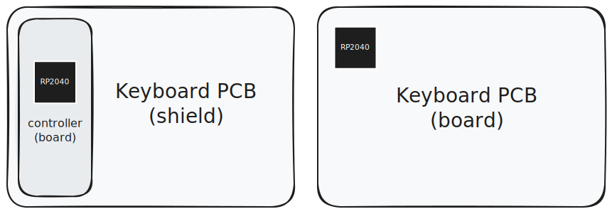

import BoardsShieldsAnimation from "@site/src/components/concepts/BoardsShieldsAnimation";

Before diving into ZMK, let's go over some of the core concepts and terminology that will help you understand how ZMK works.

## Boards and Shields

ZMK uses "boards" and "shields" to describe the hardware components of a keyboard.
Boards and shields are combined when compiling to create firmware with the complete configuration for the keyboard.

For most DIY keyboards, a complete build is made up of a board and one or more shields.

A **board** is the controller of a keyboard. It's where the main processor is soldered.
Examples of boards include Adafruit KB2040, nice!nano, nrfmicro, mikoto.

A **shield** is anything that needs to be plugged into a board to work. A keyboard PCB is (usually) a shield that needs to be connected to a board to function.
Examples of keyboard shields include Corne (v3), Kyria, and Sofle.

An exception is **keyboards with onboard processor**. Since these keyboard PCBs have the processor soldered directly to the PCB, they are considered **boards** themselves.



### Why not just "keyboard"?

By separating boards and shields, you can mix and match different form-factor compatible controllers and keyboard PCBs without needing to create a new firmware configuration for each combination. This allows for more flexibility and reusability of code.

For most DIY keyboards, it also means that you don't need to think about the lower level details of the processor like flash size and storage, clock, power, radio, or other hardware features.

<BoardsShieldsAnimation>

```yaml title="build.yaml"
---
include:
# boards-shields-yaml-board0
  - board: adafruit_kb2040//zmk
# boards-shields-yaml-board1
  - board: mikoto//zmk
# boards-shields-yaml-board2
  - board: nice_nano//zmk

    shield: my_shield
```

</BoardsShieldsAnimation>

### More about boards and shields

<details>
<summary>Why is it called "board" and "shield"?</summary>

The terms "board" and "shield" come from the Zephyr™ RTOS, which ZMK is built on top of.

The term "shield" originated from the Arduino ecosystem and refers to add-on or expansion boards that can be plugged into a main board to extend its functionality.

</details>

<details>
<summary>Why not "SoC" and "PCB"?</summary>

A board is more than just an SoC (System on a Chip). It includes configuration for the SoC, as well as any other components that are soldered to the board.

For example, wireless-capable boards might have a battery sensor configured to report battery level to ZMK. Different boards might have different flash sizes, which can affect storage and memory configuration. Boards might also have different pinouts, even if they use the same SoC and same form factor.

</details>

<details>
<summary>Can I combine any board with any shield?</summary>

In theory, yes, as long as the board and shield are compatible in terms of form factor.

However, in practice, not all boards and shields can work together. Some boards and shields might be missing configuration for certain features. Some boards and shields might be incompatible with each other due to hardware limitations. Some shields might be written without consideration for cross board compatibility and only work with one specific board.

</details>

<details>
<summary>What's `//zmk`?</summary>

The `zmk` here is the *board variant*. Most users can simply treat the full board target (e.g. `nice_nano//zmk`) as a single unit and not think about the semantics.

The `zmk` board variant provided by ZMK enables some ZMK-specific features and configuration for the board.

- `nice_nano`: nice!nano v2, with the bare minimum configuration, everything disabled by default.
- `nice_nano//zmk`: nice!nano v2, ready to run ZMK out of the box.

`nice_nano//zmk` is the short form equivalent of `nice_nano@2.0.0/nrf52840/zmk`.

If you want to learn more about board target and board variants, check out the [Zephyr documentation on this topic](https://docs.zephyrproject.org/4.1.0/hardware/porting/board_porting.html#board-terminology).

</details>

## Modules

ZMK supports modules, which contain additional source code or configuration.

Modules can provide additional boards and shields, device drivers, custom keymap behaviors, and more.

Instead of requiring all keyboard configurations to be included in the main ZMK repository, modules allow for additional configuration to be loaded from other repositories, without needing to fork the main ZMK repository.

## Split Keyboards

TODO

Central/Peripheral roles.

## File formats

ZMK uses devicetree and kconfig files.

Devicetree and Kconfig.

Link to devicetree page.

## Keymaps

Keymap and behavior.

What's behavior, why behavior. ZMK doesn't use "keycode" for everything.
