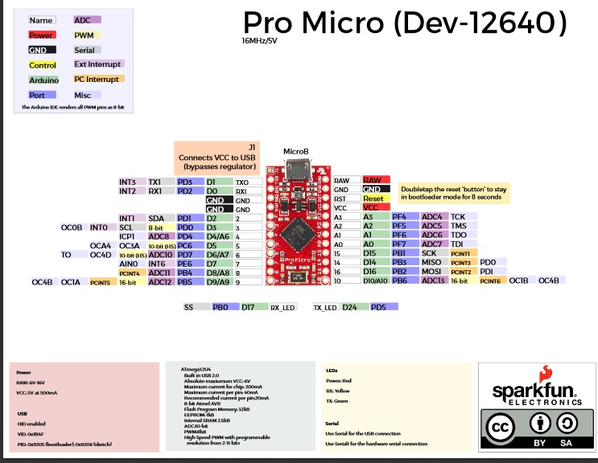

## Architecture Overview

The foundational elements needed to get a specific keyboard working with ZMK can be broken down into:

- A [KSCAN driver](https://docs.zephyrproject.org/2.3.0/reference/peripherals/kscan.html), which uses `compatible="zmk,kscan-gpio-matrix"` for GPIO matrix based keyboards, or uses `compatible="zmk,kscan-gpio-direct"` for small direct wires.
- An optional matrix transform, which defines how the KSCAN row/column events are translated into logical "key positions". This is required for non-rectangular keyboards/matrices, where the key positions don't naturally follow the row/columns from the GPIO matrix.
- A keymap, which binds each key position to a behavior, e.g. key press, mod-tap, momentary layer, in a set of layers.

These three core architectural elements are defined per-keyboard, and _where_ they are defined depends on the specifics of how that
keyboard works. For an overview on the general concepts of boards and shields, please see the [FAQs on boards and shields](/docs/faq#why-boards-and-shields--why-not-just-keyboard).

## Self-Contained Keyboard

For a self-contained keyboard that includes the microprocessor, all of the above architecture components are included in the Zephyr _board_ definition. You can see an example for the [Planck V6](https://github.com/zmkfirmware/zmk/tree/main/app/boards/arm/planck) board directory.

With this type of keyboard, the full ZMK definition for the keyboard exists
in the `app/boards/${arch}/${board_name}` directory, e.g. `app/boards/arm/planck/`. In that directory, you'll have the following:

- A `Kconfig.board` file that defines the toplevel Kconfig item for the board, including which SoC Kconfig setting it depends on.
- A `Kconfig.defconfig` file that sets some initial defaults when building this keyboard. This usually includes:
  - Setting `ZMK_KEYBOARD_NAME` to a value, for the product name to be used for USB/BLE info.
  - Setting `ZMK_USB` and/or `ZMK_BLE` for the default values for which HID transport(s) to enable by default
- A `${board_name}_defconfig` file that forces specific Kconfig settings that are specific to this hardware configuration. Mostly this is SoC settings around the specific hardware configuration.
- `${board_name}.dts` which contains all the devicetree definitions, including:
  - An `#include` line that pulls in the specific microprocessor that is used, e.g. `#include <st/f3/stm32f303Xc.dtsi>`.
  - A [chosen](https://docs.zephyrproject.org/2.3.0/guides/dts/intro.html#aliases-and-chosen-nodes) node named `zmk,kscan` which references the configured KSCAN driver (usually a GPIO matrix)
  - (Optional) A [chosen](https://docs.zephyrproject.org/2.3.0/guides/dts/intro.html#aliases-and-chosen-nodes) node named `zmk,matrix_transform` that defines the mapping from KSCAN row/column values to the logical key position for the keyboard.
- A `board.cmake` file with CMake directives for how to flash to the device.
- A `keymap/keymap.overlay` file that includes the default keymap for that keyboard. Users will be able to override this keymap in their user configs.

## Pro Micro Compatible Keyboard

For keyboards that require a (usually Pro Micro compatible) add-on board to operate, the ZMK integration pieces are places
in the _shield_ definition for that keyboard, allowing users to
swap in different Pro Micro compatible boards (e.g. Proton-C, or nice!nano) and build a firmware the matches their actual
combination of physical components.

With this type of keyboard, the partial definition for the keyboard exists
in the `app/boards/shields/${board_name}` directory, e.g. `app/boards/shields/clueboard_california/`. In that directory, you'll have the following:

- A `Kconfig.shield` that defines the toplevel Kconfig value for the shield, which uses a supplied utility to function to default the value based on the shield list, e.g. `def_bool $(shields_list_contains,clueboard_california)`.
- A `Kconfig.defconfig` file to set default values for things like `ZMK_KEYBOARD_NAME`
- A `${shield_name}.overlay` file, which is a devicetree overlay file, that includes:
  - A [chosen](https://docs.zephyrproject.org/2.3.0/guides/dts/intro.html#aliases-and-chosen-nodes) node named `zmk,kscan` which references the configured KSCAN driver (usually a GPIO matrix). For these keyboards, to be compatible with any Pro Micro compatible boards, the KSCAN configuration should reference the [nexus node](https://docs.zephyrproject.org/2.3.0/guides/porting/shields.html#gpio-nexus-nodes) that ZMK has standardized on. In particular, the `&pro_micro_a` and `&pro_micro_d` aliases can be used to reference the standard `A#` and `D#` pins in shields.
  - (Optional) A [chosen](https://docs.zephyrproject.org/2.3.0/guides/dts/intro.html#aliases-and-chosen-nodes) node named `zmk,matrix_transform` that defines the mapping from KSCAN row/column values to the logical key position for the keyboard.
- A `keymap/keymap.overlay` file that includes the default keymap for that keyboard. Users will be able to override this keymap in their user configs.
