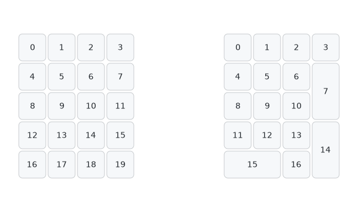

A physical layout is a devicetree entity that aggregates all details about a certain possible keyboard layout.
It contains:

- A [keyboard scan (kscan) driver](../../config/kscan.md)
- A [matrix transform](../../config/layout.md#matrix-transform)
- (Optional) [Physical key positions](#optional-keys-property)

By convention, physical layouts and any [position maps](#position-map) are defined in a separate file called `<your keyboard>-layouts.dtsi`.
This file should then be imported by the appropriate file, such as an `.overlay`, `.dts`, or a `.dtsi` (the last of which is itself imported by one of the previous).

## Basic Physical Layout

A bare physical layout without the `keys` property looks like this:

```dts title="<your keyboard>-layouts.dtsi"
/ {
    physical_layout0: physical_layout_0 {
        compatible = "zmk,physical-layout";
        display-name = "Default Layout";
    };
};
```

Every physical layout needs a matrix transform, and optionally can also have a kscan. By convention, these are assigned to the physical layout in the file where the matrix transform and kscan are defined:

```dts title="<your keyboard>.dts | <your keyboard>.dtsi | <your keyboard>.overlay"
&physical_layout0 {
    kscan = <&kscan0>; // Label of the kscan node this layout uses
    transform = <&default_transform>; // Label of the matrix transform this layout uses
};
```

The `kscan` property only needs to be assigned if some of your physical layouts use different kscans. Otherwise, it can be omitted and the `kscan` can be assigned in the [`chosen` node](./new-shield.mdx#chosen-node) instead. See the [configuration section on physical layouts](../../config/layout.md#physical-layout) for reference.

## (Optional) Keys Property

The `keys` property is required for [ZMK Studio](../../features/studio.md) support. It is used to describe the physical attributes of each key position present in that layout.

To pull in the necessary definition for creating physical layouts with the `keys` property, a new include should be added to the top of the devicetree file:

```dts title="<your keyboard>-layouts.dtsi"
#include <physical_layouts.dtsi>
```

Assigned to the `keys` property is an array of key descriptions listed in the same order as keymap bindings, matrix transforms, etc.
A key description has the shape `<&key_physical_attrs w h x y r rx ry>` with the following properties:

| Property   | Type     | Description                          | Unit                                                    |
| ---------- | -------- | ------------------------------------ | ------------------------------------------------------- |
| Width      | int (>0) | Key(cap) width                       | [centi-](https://en.wikipedia.org/wiki/Centi-)"keyunit" |
| Height     | int (>0) | Key(cap) height                      | [centi-](https://en.wikipedia.org/wiki/Centi-)"keyunit" |
| X          | uint     | Key X position (top-left point)      | [centi-](https://en.wikipedia.org/wiki/Centi-)"keyunit" |
| Y          | uint     | Key Y position (top-left point)      | [centi-](https://en.wikipedia.org/wiki/Centi-)"keyunit" |
| Rotation   | int      | Key rotation (positive => clockwise) | [centi-](https://en.wikipedia.org/wiki/Centi-)degree    |
| Rotation X | int      | Rotation origin X position           | [centi-](https://en.wikipedia.org/wiki/Centi-)"keyunit" |
| Rotation Y | int      | Rotation origin Y position           | [centi-](https://en.wikipedia.org/wiki/Centi-)"keyunit" |

You can specify negative values in devicetree using parentheses around it, e.g. `(-3000)` for a 30 degree counterclockwise rotation.

:::tip

We recommend the use of [this tool](https://zmk-physical-layout-converter.streamlit.app/) for writing a physical layout or converting one from a QMK JSON definition. If your keyboard already has a physical layout defined for the use with KLE, we recommend using [this other tool](https://nickcoutsos.github.io/keymap-layout-tools/) first to convert your existing layout into QMK JSON. The second tool can also import the position data from KiCAD, if said program was used to design the keyboard.

:::

### Physical Layout with Keys Example

Here is an example of a physical layout for a 2x2 macropad:

```dts title="macropad-layouts.dtsi"
#include <physical_layouts.dtsi>

/ {
    macropad_physical_layout: macropad_physical_layout {
        compatible = "zmk,physical-layout";
        display-name = "Macro Pad";
        transform = <&default_transform>;
        kscan = <&kscan0>;
        keys  //                     w   h    x    y     rot    rx    ry
            = <&key_physical_attrs 100 100    0    0       0     0     0>
            , <&key_physical_attrs 100 100  100    0       0     0     0>
            , <&key_physical_attrs 100 100    0  100       0     0     0>
            , <&key_physical_attrs 100 100  100  100       0     0     0>
            ;
    };
};
```

## Using Predefined Layouts

ZMK defines a number of popular physical layouts in-tree at [`app/dts/layouts`](https://github.com/zmkfirmware/zmk/tree/main/app/dts/layouts).
To use such layouts, import them and assign their `transform` and (optionally) `kscan` properties.

Here is an example of using the predefined physical layouts for a keyboard with the same layout as the "ferris":

```dts title="ferris.dtsi"
#include <layouts/cuddlykeyboards/ferris.dtsi>

// Assigning suitable kscan and matrix transforms
&cuddlykeyboards_ferris_layout {
    transform = <&default_transform>;
    kscan = <&kscan0>;
};
```

Shared physical layouts found in the same folder are defined such that they can be used together, to define [multiple physical layout](#multiple-physical-layouts) options. See below for more information on multiple physical layouts.

Here is an example of using the predefined physical layouts for a 60% keyboard:

```dts title="bt60_v1.dts"
#include <layouts/common/60percent/all1u.dtsi>
#include <layouts/common/60percent/ansi.dtsi>
#include <layouts/common/60percent/hhkb.dtsi>
#include <layouts/common/60percent/iso.dtsi>


// Assigning suitable kscan and matrix transforms
&layout_60_ansi {
    transform = <&ansi_transform>;
    kscan = <&ansi_kscan>;
};

&layout_60_iso {
    transform = <&iso_transform>;
    kscan = <&iso_kscan>;
};

&layout_60_all1u {
    transform = <&all_1u_transform>;
    kscan = <&all_1u_kscan>;
};

&layout_60_hhkb {
    transform = <&hhkb_transform>;
    kscan = <&hhkb_kscan>;
};
```

## Multiple Physical Layouts

If a keyboard has multiple possible layouts (e.g. you can snap off an outer column), then you should define multiple matrix transformations and multiple physical layouts, one for each possible layout.
If necessary, you can also define multiple kscan instances.

```dts title="<your keyboard>-layouts.dtsi"
// Needed if and only if keys property is used
#include <physical_layouts.dtsi>

/ {
    default_layout: default_layout {
        compatible = "zmk,physical-layout";
        display-name = "Default Layout";
        transform = <&default_transform>;
        kscan = <&kscan0>;
        keys = <...>; // List of key positions, optional
    };

    alt_layout: alt_layout {
        compatible = "zmk,physical-layout";
        display-name = "Alternate Layout";
        transform = <&alt_transform>;
        kscan = <&alt_kscan0>;
        keys = <...>; // List of key positions, optional
    };
};
```

### Position Map

When switching between layouts using [ZMK Studio](../../features/studio.md), an attempt is made to automatically infer bindings for the keys in the new layout from the old layout. Keys with the same physical key properties are given the same binding. This approach has some limitations, so for more accurate transference of bindings a position map is used.

:::warning

Keys whose positions can neither be inferred from the default layout nor have bindings in the position map cannot be assigned to.

:::

A position map looks something like this:

```dts title="<your keyboard>-layouts.dtsi"
/ {
    position_map {
        compatible = "zmk,physical-layout-position-map";
        complete; // Optional, see 'Example non-complete position map'
        layout1: layout1 {
            physical-layout = <&physical_layout1>;
            positions = <...>; // List of positions to map
        };
        layout2: layout2 {
            physical-layout = <&physical_layout2>;
            positions = <...>; // List of positions to map
        };
        // Additional layout child nodes
    };
};
```

A child node is defined for every layout the keyboard can have. The `positions` properties each contain an array of indices, which are used to refer to keys in the `keys` array of their corresponding physical layout. A `0` in the `positions` property refers to the first key in the `keys` array, a `1` refers to the second, and so on.

When switching from one layout to another, say from layout 1 to layout 2, the _orderings_ found in the `positions` arrays are used. The first key in the `positions` array of layout 2 is given the binding assigned to the first key in the `positions` array of layout 1, the second key in the `positions` array of layout 2 is given the binding assigned to the second key in the `positions` array of layout 1, and so on.

The position map should be marked as `complete` if all desired binding transfers are defined within it. Otherwise, [ZMK Studio](../../features/studio.md) will continue to automatically determine assignments for keys not listed in the position map. See [this example non-complete position map](#example-non-complete-position-map) for why this could be useful.

See also the [configuration section on position maps](../../config/layout.md#physical-layout-position-map).

:::tip

We recommend the use of [this tool](https://zmk-layout-helper.netlify.app/), distinct from the previous two mentioned, for the purposes of writing a position map.

:::

#### Writing a position map

Start by creating the parent node defining the position map:

```dts title="<your keyboard>-layouts.dtsi"
/ {
    keypad_position_map {
        compatible = "zmk,physical-layout-position-map";
        complete; // Optional, see 'Example non-complete position map'

        // Child node 1 here

        // Child node 2 here

        // ...
    };
};
```

It is easiest to write the position map by considering one layout to be the "reference" layout, and defining all other position maps with respect to it. The reference layout should usually be the one with the most keys, as that creates a position map where no key bindings are lost when switching to a layout with fewer keys and back.

Create the child node for the reference layout, and fill the `positions` array by counting upwards, giving it the same order and number of keys as the `keys` property of its physical layout. For a 2x2 macropad the child node would be

```dts title="2x2macropad-layouts.dtsi"
/ {
    keypad_position_map {
        // Other properties

        macropad_map: macropad {
            physical-layout = <&macropad_layout>;
            positions // This is equivalent to `positions = <0 1 2 3>;`, reshaped for readability
                = < 0  1 >
                , < 2  3 >;
        };
    };
};
```

Next write the child nodes for every other layout with respect to the reference. For keys present in the reference which aren't present in the layout you're writing the child node for, count backwards: The first key that isn't present is given the highest number found in the `positions` array of the reference, the second key that isn't present is given the second highest number, and so on. The below examples show this process more clearly.

#### Example larger position map

Consider the following macropad/numpad with two physical layouts:



Let us first consider each side individually. The "reference" position map of the left side would look like this:

```dts title="macropad-layouts.dtsi"
/ {
    keypad_position_map {
        // Other properties

        macropad_map: macropad {
            physical-layout = <&macropad_layout>;
            positions
                = < 0  1  2  3>
                , < 4  5  6  7>
                , < 8  9 10 11>
                , <12 13 14 15>
                , <16 17 18 19>;
        };
    };
};
```

Meanwhile, the "reference" position map of the right side with fewer keys would look like this:

```dts title="macropad-layouts.dtsi"
/ {
    keypad_position_map {
        // Other properties

        numpad_map: numpad {
            physical-layout = <&numpad_layout>;
            positions
                = < 0  1  2  3>
                , < 4  5  6  7>
                , < 8  9 10   >
                , <11 12 13 14>
                , <15    16   >;
        };
    };
};
```

As a reminder, the `positions` property is a one-dimensional array like the `keys` property, formatted nicely through the use of whitespace and angle bracket groupings.

If the left side with more keys was used as the reference layout, then the overall position map of the keyboard would look like this:

```dts title="macropad-layouts.dtsi"
/ {
    keypad_position_map1 {
        compatible = "zmk,physical-layout-position-map";
        complete;

        macropad_map: macropad {
            physical-layout = <&macropad_layout>;
            positions
                = < 0  1  2  3>
                , < 4  5  6  7>
                , < 8  9 10 11>
                , <12 13 14 15>
                , <16 17 18 19>;
        };

        numpad_map: numpad {
            physical-layout = <&numpad_layout>;
            positions
                = < 0  1  2  3>
                , < 4  5  6  7>
                , < 8  9 10 19>
                , <11 12 13 14>
                , <15 18 16 17>;
        };
    };
};
```

The "missing" positions are filled with the "spare" numbers of the layout with more keys. The order in which the spare keys are used is arbitrary and counting backwards is a convenient way to assign them.

If the right side with fewer keys were used as a reference instead, then the overall position map would look like this:

```dts title="macropad-layouts.dtsi"
/ {
    keypad_position_map2 {
        compatible = "zmk,physical-layout-position-map";
        complete;

        macropad_map: macropad {
            physical-layout = <&macropad_layout>;
            positions
                = < 0  1  2  3>
                , < 4  5  6  7>
                , < 8  9 10   >
                , <12 13 14 15>
                , <16    18   >;
        };

        numpad_map: numpad {
            physical-layout = <&numpad_layout>;
            positions
                = < 0  1  2  3>
                , < 4  5  6  7>
                , < 8  9 10   >
                , <11 12 13 14>
                , <15    16   >;
        };
    };
};
```

There is functionally no difference between the two approaches, but the first approach is recommended.

#### Example non-`complete` position map

Consider the above device again -- most of the positions have identical `keys` properties. For example, the macropad's `12` key and the numpad's `11` key would have the same physical property, and be mapped to each other automatically. The keys whose mappings are unable to be determined automatically are those with different physical characteristics: the 2u high and 2u wide keys, and their corresponding 1u counterparts.

A non-`complete` position map can be used to assign mappings to only these particular keys:

```dts title="macropad-layouts.dtsi"
/ {
    keypad_position_map3 {
        compatible = "zmk,physical-layout-position-map";

        macropad_map: macropad {
            physical-layout = <&macropad_layout>;
            positions = <7 15 16>;
        };

        numpad_map: numpad {
            physical-layout = <&numpad_layout>;
            positions = <7 14 15>;
        };
    };
};
```

This is noticably simpler to write, and can be a useful way of saving flash space for memory-constrained devices.

#### Additional example: corne

The following is an example of a position map which maps the 5-column and 6-column Corne keymap layouts. The 6 column layout is the reference layout.

```dts
    foostan_corne_lossless_position_map {
        compatible = "zmk,physical-layout-position-map";

        complete;

        twelve_map: twelve {
            physical-layout = <&foostan_corne_6col_layout>;
            positions
                = < 0  1  2  3  4  5  6  7  8  9 10 11>
                , <12 13 14 15 16 17 18 19 20 21 22 23>
                , <24 25 26 27 28 29 30 31 32 33 34 35>
                , <         36 37 38 39 40 41         >;
        };

        ten_map: ten {
            physical-layout = <&foostan_corne_5col_layout>;
            positions
                = <41  0  1  2  3  4  5  6  7  8  9 40>
                , <39 10 11 12 13 14 15 16 17 18 19 38>
                , <37 20 21 22 23 24 25 26 27 28 29 36>
                , <         30 31 32 33 34 35         >;
        };
    };
```

The above position map is in actuality spread over [multiple files](https://github.com/zmkfirmware/zmk/tree/main/app/dts/layouts/foostan/corne), as one of our predefined layouts.
