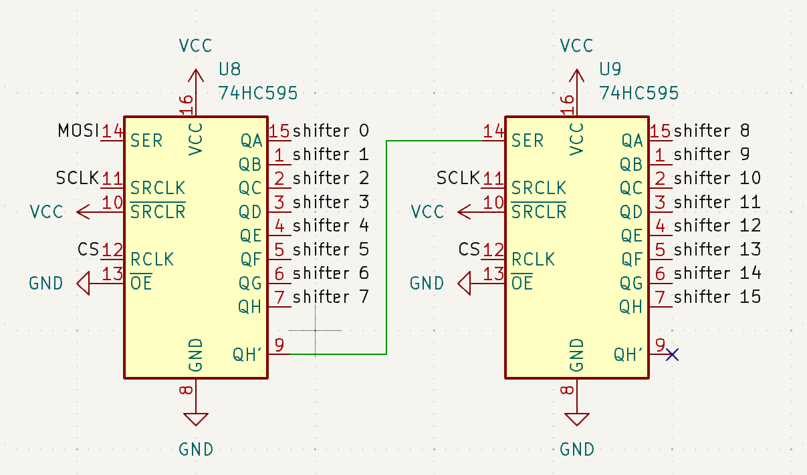

Shift registers are the recommended method of adding additional GPIO pins to MCUs and boards, when a standard matrix results in an insufficient number of keys. They are recommended because they simultaneously have very low power consumption and are quite cheap. This page serves as a (brief) introduction to shift registers, how to use them in your design, and how to configure ZMK to use them correctly.

:::note
This page assumes that you are using a SIPO shift register with the part number 74HC595. Other shift registers can work as well but this is the most commonly used one.
:::

:::tip
To understand how shift registers work, we recommend reading through ["How does the 74HC595 Shift Register work?"](https://lastminuteengineers.com/74hc595-shift-register-arduino-tutorial/#how-does-the-74hc595-shift-register-work).
:::

## Design Guidelines

The shift register output pins should act as MCU outputs in your design. All MCU inputs should remain connected directly to MCU/board pins. This is to allow the inputs to trigger "interrupts" on the MCU/board, upon which it will begin scanning the keys. Using a shift register for MCU inputs is also possible, but requires you to use a PISO shift register and will harm your battery life. Note that a [direct kscan](../../config/kscan.md#direct-gpio-driver) keyboard does not have any MCU output pins, but a diodeless keyboard is still possible by making use of a single row pin and using the [matrix kscan](../../config/kscan.md#matrix-driver) driver.

:::info
In a diode matrix, MCU output pins are those connected to the [anodes of your diodes](https://learn.sparkfun.com/tutorials/diodes/all#ideal-diodes). You most likely will need to rearrange your matrix to maximize the use of shift register output pins, in order to reduce the total number of GPIO pins connected to your MCU. For example, a 9 column 5 row `col2row` matrix could be rearranged to use 16 columns and 3 rows.
:::

You will want to make sure that the data and clock pins of the shift register are connected to high frequency/SPI-capable pins on your MCU. Make sure that these lie on the same SPI bus for your microcontroller, if applicable -- for instance RP2040 controllers require this, while nRF52840 ones do not. It is generally recommended that you use the pre-defined pins for SPI, if your board comes with them.

ZMK allows you to daisy-chain up to four shift registers. Below is a fragment of a schematic showing two shift registers that are daisy-chained.



## Configuration

In ZMK, the SPI bus of your MCU is used to communicate with shift registers, using MOSI for SIPO shift registers and MISO for PISO shift registers. See [Pin Control](./pinctrl.mdx) for information on configuring the SPI bus. Shift registers can share the SPI bus with other devices with no issues.

Some boards, such as Seeed Studio's Xiao series, already has particular pins defined and configured for SPI (these can be changed if the MCU allows for alternative selections of SPI pins). Others, such as the nice!nano or any custom board, will need to be configured by you manually.

### Enable SPI

Add the following line to `<your device>.defconfig`, inside of your device's `if` block:

```kconfig title="<your device>.defconfig"
config SPI
    default y
```

### Shift Register SPI Device

To add your shift register as a SPI device, you'll need to overwrite your board's SPI configuration. For example, if your SPI bus has the node label `xiao_spi`, then you would add the following to your `<your shield>.overlay`:

```dts title="<your shield>.overlay"
&xiao_spi {
    status = "okay";
    cs-gpios = <&xiao_d 9 GPIO_ACTIVE_LOW>;
    shifter: 595@0 {
        compatible = "zmk,gpio-595";
        status = "okay";
        gpio-controller;
        spi-max-frequency = <200000>;
        reg = <0>;
        #gpio-cells = <2>;
        ngpios = <8>;
    };
};
```

If there is more than one device on the SPI bus, you will need to add additional pins to the `cs-gpios` phandle array - one for each device. The `@0` number marks the index of the `cs-gpios` pin used to control a device. If you have daisy chained multiple shift registers, you'll also want to increase the number of GPIOs that the shift register provides by editing the `ngpios` node - set this to your number of output pins (should be one of 8, 16, 24, 32). You may also need to increase `spi-max-frequency` to a higher value if you have daisy chained shift registers, otherwise quick key presses may on occasion not trigger.

### Using Shift Register Pins In Kscan

Once all of this is set up, you can refer to pins from the shift register using `&shifter X` where X is the pin number. Use this to define your kscan, for example:

```dts title="<your shield>.overlay"
kscan0: kscan_0 {
    compatible = "zmk,kscan-gpio-matrix";
    diode-direction = "col2row";
    col-gpios
        = <&shifter 7 GPIO_ACTIVE_HIGH>
        , <&shifter 6 GPIO_ACTIVE_HIGH>
        , <&shifter 5 GPIO_ACTIVE_HIGH>
        , <&shifter 4 GPIO_ACTIVE_HIGH>
        , <&shifter 3 GPIO_ACTIVE_HIGH>
        , <&shifter 2 GPIO_ACTIVE_HIGH>
    ;
};
```
