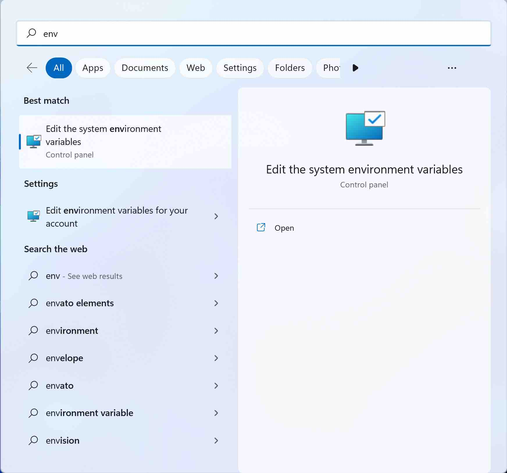
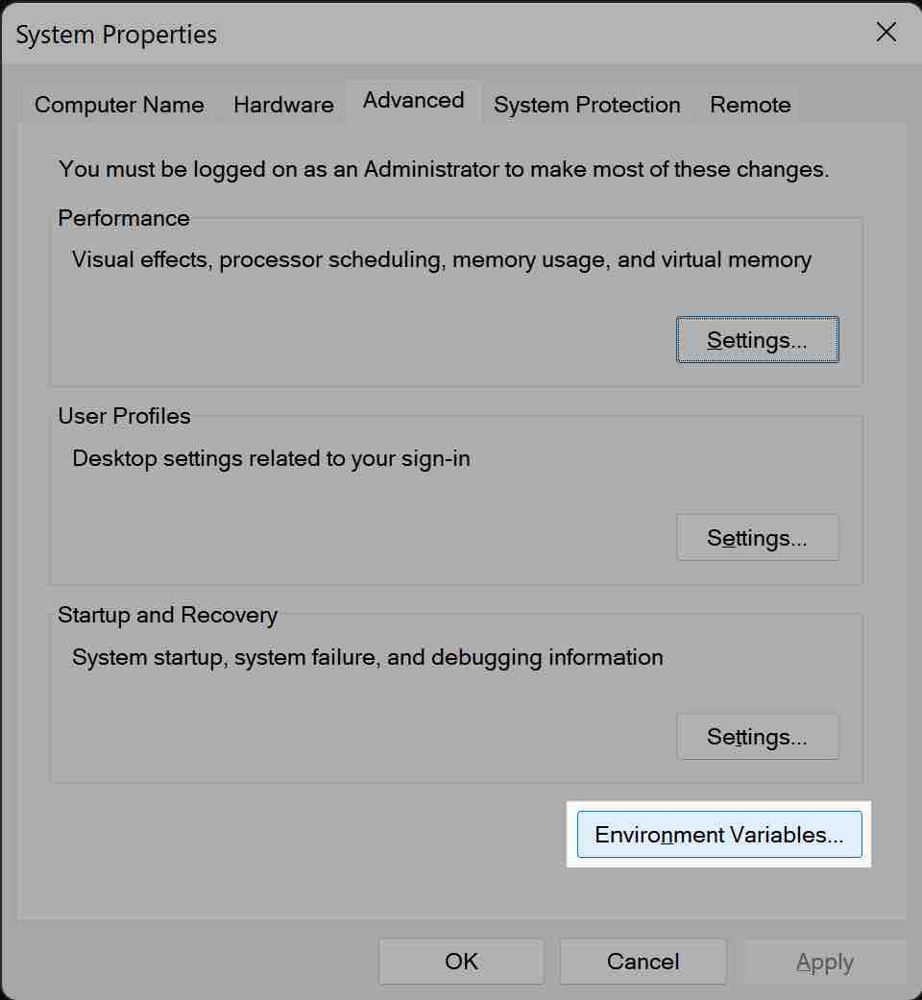
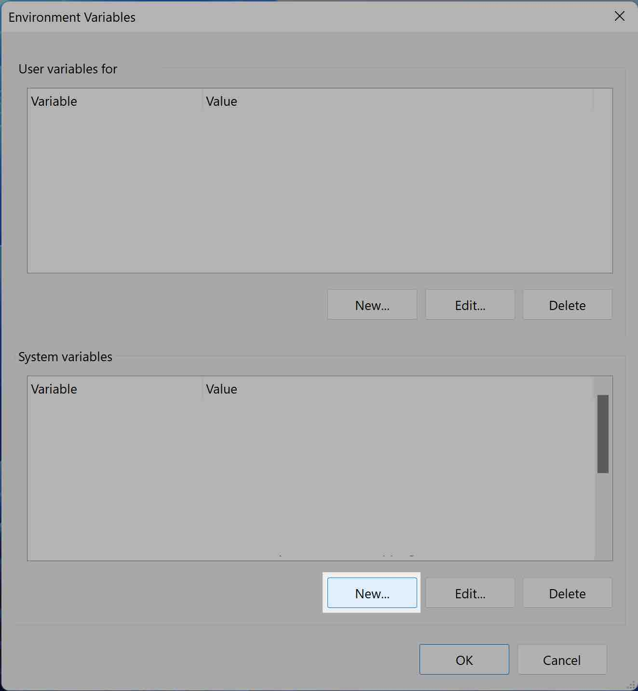
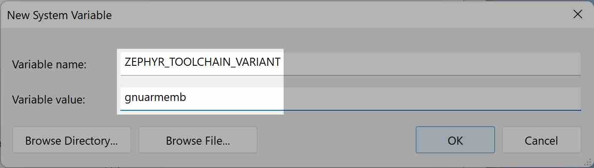
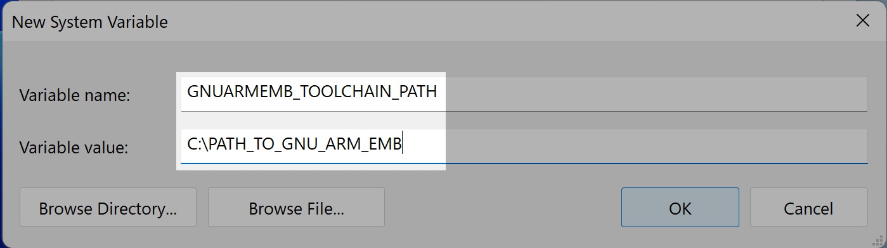

import Tabs from '@theme/Tabs';
import TabItem from '@theme/TabItem';

export const OsTabs = (props) => (<Tabs
groupId="operating-systems"
defaultValue="debian"
values={[
{label: 'Debian/Ubuntu', value: 'debian'},
{label: 'Windows', value: 'win'},
{label: 'macOS', value: 'mac'},
{label: 'Raspberry OS', value: 'raspberryos'},
{label: 'Fedora', value: 'fedora'},
{label: 'VS Code & Docker', value: 'docker'},
]
}>{props.children}</Tabs>);

## Prerequisites

ZMK requires the following base packages to first be installed:

- Git
- Python 3
- `pip`
- `wget`
- devicetree compiler
- CMake
- `dfu-util`
- Various build essentials, e.g. gcc, automake, autoconf

<OsTabs>
<TabItem value="debian">

On Debian and Ubuntu, we'll use `apt` to install our base dependencies:

First, if you haven't updated recently, or if this is a new install,
you should update to get the latest package information:

```sh
sudo apt update
```

With the latest package information, you can now install the base dependencies:

```sh
sudo apt install -y \
	git \
	wget \
	autoconf \
	automake \
	build-essential \
        bzip2 \
	ccache \
	device-tree-compiler \
	dfu-util \
	g++ \
	gcc \
	libtool \
	make \
	ninja-build \
	cmake \
	python3-dev \
	python3-pip \
	python3-setuptools \
	xz-utils
```

:::note
Recent LTS releases of Debian and Ubuntu may include outdated CMake versions. If the output of `cmake --version` is older than 3.15, upgrade your distribution (e.g., from Ubuntu 18.04 LTS to Ubuntu 20.04 LTS), or else install CMake version 3.15 or newer manually (e.g, from Debian backports or by building from source).

There is also a [zephyr bug](https://github.com/zephyrproject-rtos/zephyr/issues/22060) with cmake 3.19.x. You'll need a version _below_ 3.19.
:::
</TabItem>
<TabItem value="raspberryos">

On Raspberry OS, we'll use `apt` to install our base dependencies:

First, if you haven't updated recently, or if this is a new install,
you should update to get the latest package information:

```sh
sudo apt update
```

With the latest package information, you can now install the base dependencies:

```sh
sudo apt install -y \
	git \
	wget \
	autoconf \
	automake \
	build-essential \
        bzip2 \
	ccache \
	device-tree-compiler \
	dfu-util \
	g++ \
	gcc \
	libtool \
	make \
	ninja-build \
	cmake \
	python3-dev \
	python3-pip \
	python3-setuptools \
	xz-utils
```

</TabItem>
<TabItem value="fedora">

On Fedora, we'll use `dnf` to install our base dependencies:

#### DNF Update

First, if you haven't updated recently, or if this is a new install,
you should update to get the latest package information:

```sh
sudo dnf update
```

#### Install Dependencies

With the latest package information, you can now install the base dependencies:

```sh
sudo dnf install -y \
	git \
	wget \
	autoconf \
	automake \
        bzip2 \
	ccache \
	dtc \
	dfu-util \
	g++ \
	gcc \
	libtool \
	make \
	ninja-build \
	cmake \
	python3-devel \
	python3-pip \
	python3-setuptools \
	xz
```

</TabItem>
<TabItem value="win">

:::note
Use `cmd.exe` with these instructions rather than PowerShell.
:::

Chocolatey is recommended and used for the following instructions. You can manually install each of these applications and add them to your `PATH` if you don't want to use Chocolatey.

1. [Install Chocolatey](https://chocolatey.org/install)
2. Open `cmd.exe` as **Administrator**
3. Run the following `choco` commands:
   ```shell
   choco install cmake --installargs 'ADD_CMAKE_TO_PATH=System'
   choco install ninja gperf python git
   ```

It is recommended to install `dfu-util` to avoid any later confusion while flashing devices. You can do this by running this command with chocolatey:

```shell
choco install dfu-util
```

</TabItem>
<TabItem value="mac">

#### Homebrew

Homebrew is required to install the system dependencies. If you haven't done so, visit [Homebrew](https://brew.sh/) for instructions. Once installed, use it to install the base dependencies:

```
brew install cmake ninja python3 ccache dtc git wget dfu-util
```

</TabItem>
<TabItem value="docker">

This setup leverages the same [image which is used by the GitHub action](https://github.com/zmkfirmware/zephyr-west-action) for local development. Beyond the benefits of [dev/prod parity](https://12factor.net/dev-prod-parity), this approach is also the easiest to set up. No toolchain or dependencies are necessary when using Docker; the container image you'll be using already has the toolchain installed and set up to use.

1. Install [Docker Desktop](https://www.docker.com/products/docker-desktop) for your operating system.
2. Install [VS Code](https://code.visualstudio.com/)
3. Install the [Remote - Containers extension](https://marketplace.visualstudio.com/items?itemName=ms-vscode-remote.remote-containers)

:::info
The docker container includes `west` and the compilation toolchain. If you're using docker and VS Code, you can skip right to [Source Code](#source-code).
:::

</TabItem>
</OsTabs>

## Setup

### West Installation

`west` is the [Zephyr™ meta-tool](https://docs.zephyrproject.org/2.3.0/guides/west/index.html) used to configure and build Zephyr™ applications.

West can be installed by using the `pip` python package manager. The [Zephyr™ instructions](https://docs.zephyrproject.org/latest/guides/west/install.html#installing-west) are summarized here:

<Tabs
defaultValue="linux"
values={[
{label: 'Linux', value: 'linux'},
{label: 'Windows', value: 'win'},
]}>
<TabItem value = 'linux'>

```sh
pip3 install --user -U west
```

</TabItem>
<TabItem value = 'win'>

In `cmd.exe` as **Administrator**:

```sh
pip3 install -U west
```

:::note
**For Windows, do not use the `--user` argument** that Linux uses otherwise `west` will be installed in a different location and the below instructions for adding Python `pip` will no longer apply.
:::

Once `west` is installed, close Command Prompt and open a new session as a **user** for the remainder of the instructions.

</TabItem>
</Tabs>

:::danger `pip` user packages
If you haven't done so yet, you may need to add the Python `pip` package directory to your `PATH` otherwise your computer will not be able to find the `west` command.
:::

<Tabs
defaultValue="linux"
values={[
{label: 'Linux', value: 'linux'},
{label: 'Windows', value: 'win'},
]}>
<TabItem value = 'linux'>
Run the following commands:

```sh
echo 'export PATH=~/.local/bin:"$PATH"' >> ~/.bashrc
source ~/.bashrc
```

</TabItem>
<TabItem value = 'win'>

1. See the [Environment Variables](#environment-variables) section on how to get to the Environment Variables page.
2. Under "System variables" select the "Path" variable. Click "Edit..." and then "New" to add the directory where your `west.exe` is located. By default this should be `C:\Python##\Scripts` where ## is your Python version number.
3. Close Command Prompt and open a new session for the changes to take effect, or run `refreshenv`.

</TabItem>
</Tabs>

### Toolchain Installation

The toolchain provides the compiler, linker, etc., necessary to build for the target
platform.

<OsTabs>
<TabItem value="debian">

#### Zephyr™ ARM SDK

To build firmwares for the ARM architecture (all supported MCUs/keyboards at this point), you'll need to install the Zephyr™ ARM SDK to your system:

```
export ZSDK_VERSION=0.11.4
wget -q "https://github.com/zephyrproject-rtos/sdk-ng/releases/download/v${ZSDK_VERSION}/zephyr-toolchain-arm-${ZSDK_VERSION}-setup.run" && \
	sh "zephyr-toolchain-arm-${ZSDK_VERSION}-setup.run" --quiet -- -d ~/.local/zephyr-sdk-${ZSDK_VERSION} && \
	rm "zephyr-toolchain-arm-${ZSDK_VERSION}-setup.run"
```

The installation will prompt with several questions about installation location, and creating a default `~/.zephyrrc` for you with various variables. The defaults should normally work as expected.

</TabItem>
<TabItem value="raspberryos">

Because Raspberry OS (Raspbian) runs on the same architecture (but different ABI) as the keyboard MCUs,
the operating system's installed [cross compilers](https://docs.zephyrproject.org/2.3.0/getting_started/toolchain_other_x_compilers.html) can be used to target the different ABI.

First, the cross compiler should be installed:

```sh
sudo apt install gcc-arm-none-eabi
```

Next, we'll configure Zephyr™ with some extra environment variables needed to find the cross compiler by adding the following to `~/.zephyrrc`:

```sh
export ZEPHYR_TOOLCHAIN_VARIANT=cross-compile
export CROSS_COMPILE=/usr/bin/arm-none-eabi-
```

</TabItem>
<TabItem value="fedora">

#### Zephyr™ ARM SDK

To build firmwares for the ARM architecture (all supported MCUs/keyboards at this point), you'll need to install the Zephyr™ ARM SDK to your system:

```
export ZSDK_VERSION=0.11.4
wget -q "https://github.com/zephyrproject-rtos/sdk-ng/releases/download/v${ZSDK_VERSION}/zephyr-toolchain-arm-${ZSDK_VERSION}-setup.run" && \
 sh "zephyr-toolchain-arm-${ZSDK_VERSION}-setup.run" --quiet -- -d ~/.local/zephyr-sdk-${ZSDK_VERSION} && \
 rm "zephyr-toolchain-arm-\${ZSDK_VERSION}-setup.run"
```

The installation will prompt with several questions about installation location, and creating a default `~/.zephyrrc` for you with various variables. The defaults should normally work as expected.

</TabItem>
<TabItem value="win">

#### GNU ARM Embedded

Since the Zephyr™ SDK is not available for Windows, we recommending following the [Zephyr documentation](https://docs.zephyrproject.org/2.3.0/getting_started/toolchain_3rd_party_x_compilers.html#gnu-arm-embedded) to install a GNU ARM Embedded build. Note the warnings regarding installing the toolchain into a path with spaces, and make sure to follow the steps to add the environment variables which are also summarized with screenshots in the [Environment Variables](#environment-variables) section below.

</TabItem>
<TabItem value="mac">

#### GNU ARM Embedded

Since the Zephyr™ SDK is not available for macOS, we recommending following the steps to install the [GNU ARM Embedded](https://docs.zephyrproject.org/2.3.0/getting_started/toolchain_3rd_party_x_compilers.html#gnu-arm-embedded).

:::warning Security Controls Workaround

Please be sure to read the [additional setup instructions](https://docs.zephyrproject.org/2.3.0/getting_started/installation_mac.html#mac-gatekeeper) needed to address security controls found in macOS 10.15 Catalina and newer

:::

</TabItem>
</OsTabs>

:::note
If you intend to build firmware straight away, make sure to correctly setup the current shell.

Notes on setting this up can be found in the [Environment Variables](#environment-variables) section.
The transient instructions can be used to setup the current shell, and the automatic instructions can setup any newly made shells automatically.

The transient instructions must be run to build firmware using the current shell.
:::

### Source Code

Next, you'll need to clone the ZMK source repository if you haven't already. Navigate to the folder you would like to place your `zmk` directory in and run the following command:

```
git clone https://github.com/zmkfirmware/zmk.git
```

### Initialize & Update Zephyr Workspace

Since ZMK is built as a Zephyr™ application, the next step is
to use `west` to initialize and update your workspace. The ZMK
Zephyr™ application is in the `app/` source directory:

#### Step into the repository

<OsTabs>
<TabItem value="debian">

```sh
cd zmk
```

</TabItem>
<TabItem value="raspberryos">

```sh
cd zmk
```

</TabItem>
<TabItem value="fedora">

```sh
cd zmk
```

</TabItem>
<TabItem value="mac">

```sh
cd zmk
```

</TabItem>
<TabItem value="win">

```sh
cd zmk
```

</TabItem>

<TabItem value="docker">

Open the `zmk` checkout folder in VS Code. The repository includes a configuration for containerized development, so an alert will pop up:


Click `Reopen in Container` in order to reopen the VS Code with the running container.

The first time you do this on your machine, it will pull the docker image down from the registry and build the container. Subsequent launches are much faster!

:::caution
All subsequent steps must be performed from the VS Code terminal _inside_ the container.
:::

</TabItem>
</OsTabs>

#### Initialize West

```sh
west init -l app/
```

:::caution Command Not Found?
If you encounter errors like `command not found: west` then your `PATH` environment variable is likely
missing the Python 3 user packages directory. See the [West Build Command](#west-build-command)
section again for links to how to do this
:::

#### Update To Fetch Modules

```sh
west update
```

:::tip
This step pulls down quite a bit of tooling. Go grab a cup of coffee, it can take 10-15 minutes even on a good internet connection!
:::

:::info
If you're using Docker, you're done with setup! You must restart the container at this point. The easiest way to do so is to close the VS Code window, verify that the container has stopped in Docker Dashboard, and reopen the container with VS Code.

Once your container is restarted, proceed to [Building and Flashing](./development/build-flash.md).
:::

#### Export Zephyr™ Core

```sh
west zephyr-export
```

#### Install Zephyr Python Dependencies

```sh
pip3 install --user -r zephyr/scripts/requirements-base.txt
```

### Environment Variables

<Tabs
defaultValue="win"
values={[
{label: 'Windows', value: 'win'},
{label: 'Other OS', value: 'other'},
]}>
<TabItem value = 'win'>

#### For GNU ARM Embedded on Windows

On Windows, only two environment variables need to be set for ZMK to build properly: `ZEPHYR_TOOLCHAIN_VARIANT` and `GNUARMEMB_TOOLCHAIN_PATH`.

1. Open Start Menu and type 'env' to find the 'Edit the system environment variables' option. Open it.



2. Click 'Environment Variables...'.



3. Click "New..." under System variables to create a new system variable.



4. Set the variable name to 'ZEPHYR_TOOLCHAIN_VARIANT' and value to 'gnuarmemb'. Click OK to save.



5. Create another variable with variable name 'GNUARMEMB_TOOLCHAIN_PATH' and value set to wherever you installed your toolchain. **Make sure this path does not contain any spaces.** If it does, rename the folder and update here. Click OK to save.



6. Close Command Prompt and reopen, or run `refreshenv` to apply the changes.

</TabItem>

<TabItem value = 'other'>

#### For Zephyr

By default, the Zephyr™ SDK will create a file named `~/.zephyrrc` with the correct environment variables to build ZMK.
We suggest two main [options](https://docs.zephyrproject.org/2.3.0/guides/env_vars.html?highlight=zephyrrc) for how to load those settings.

##### Per Shell

To load the Zephyr environment properly for just one transient shell, run the following from your ZMK checkout directory:

```
source zephyr/zephyr-env.sh
```

##### All Shells

To load the environment variables for your shell every time,
append the existing `~/.zephyrrc` file to your shell's RC file and then start a new shell.

<Tabs
groupId="shell"
defaultValue="bash"
values={[
{label: 'bash', value: 'bash'},
{label: 'zsh', value: 'zsh'},
]
}>

<TabItem value="bash">

```
cat ~/.zephyrrc >> ~/.bashrc
```

</TabItem>

<TabItem value="zsh">

```
cat ~/.zephyrrc >> ~/.zshrc
```

</TabItem>

</Tabs>

</TabItem>

</Tabs>
