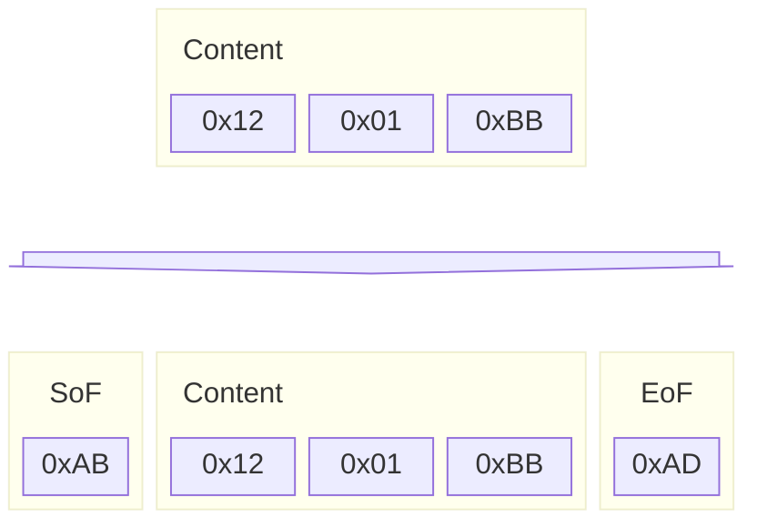
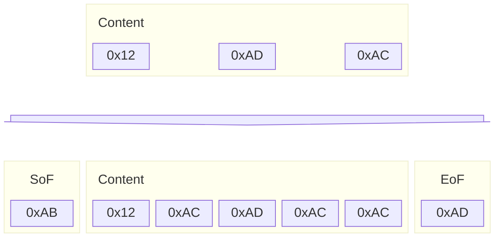

:::warning[Beta Feature]

ZMK Studio is in beta. Although every effort has been made to provide a stable experience, you may still encounter issues during use. Please report any issues to [GitHub Issues](https://github.com/zmkfirmware/zmk-studio/issues).

:::

:::danger
Before reading this section, it is **vital** that you read through our [clean room policy](./contributing/clean-room.md).
:::

## Overview

The ZMK Studio UI communicates with ZMK devices using a custom RPC protocol developed to be robust and reliable, while remaining simple and easy to extend with future enhancements.

The protocol consists of [protocol buffer](https://protobuf.dev/programming-guides/proto3/) messages which are encoded/decoded using message framing, and then transmitted using an underlying transport. Two transports are currently implemented: a BLE transport using a custom GATT service and a serial port transport, which usually is used with CDC ADM devices over USB.

## Protobuf Messages

The messages for ZMK Studio are defined in a dedicated [zmk-studio-messages](https://github.com/zmkfirmware/zmk-studio-messages) repository. Fundamentally, the [`Request`](https://github.com/zmkfirmware/zmk-studio-messages/blob/main/proto/zmk/studio.proto#L11) message is used to send any requests from the ZMK Studio client to the ZMK device, and the [`Response`](https://github.com/zmkfirmware/zmk-studio-messages/blob/main/proto/zmk/studio.proto#L21) messages are sent from the ZMK device to the Studio client.

Responses can either be [`RequestResponses`](https://github.com/zmkfirmware/zmk-studio-messages/blob/main/proto/zmk/studio.proto#L28) that are sent in response to an incoming `Request` or a [`Notification`](https://github.com/zmkfirmware/zmk-studio-messages/blob/main/proto/zmk/studio.proto#L38) which is sent at any point from the ZMK device to the ZMK Studio client to inform the client about state changes on the device, e.g. that the device is unlocked.

## Message Framing

ZMK Studio uses a simple framing protocol to easily identify the start and end of a given message, with basic escaping to allow for unrestricted content.

The following special bytes are used for the framing protocol:

- Start of Frame (SoF): `0xAB`
- Escape Byte (Esc): `0xAC`
- End of Frame (EoF): `0xAD`

A message consists of a SoF byte, the payload, escaped as needed, followed by an EoF byte. Within the payload, any of the special encoding bytes will be escaped by being prefixed with an Esc byte.

### Example Encoding (Simple)

Here is an example encoding when the message content does not include any of the special bytes:

### Example Encoding (Escaping)

When the message content includes any of the special bytes, those bytes are escaped whe framed

## Transports

Two transports are available right now, over USB or Bluetooth connections.

### USB (Serial)

The USB transport is actually a basic serial/UART transport, that happens to use the CDC/ACM USB class for a serial connection. Framed messages are sent between ZMK Studio client and ZMK device using simple UART transmission.

### Bluetooth (GATT)

The bluetooth transport uses a custom GATT service to transmit/receive. The service has UUID `00000000-0196-6107-c967-c5cfb1c2482a` and has exactly one characteristic with UUID `00000001-0196-6107-c967-c5cfb1c2482a`. The characteristic accepts writes of framed client messages, and will use GATT Indications to send framed messages to the client.
