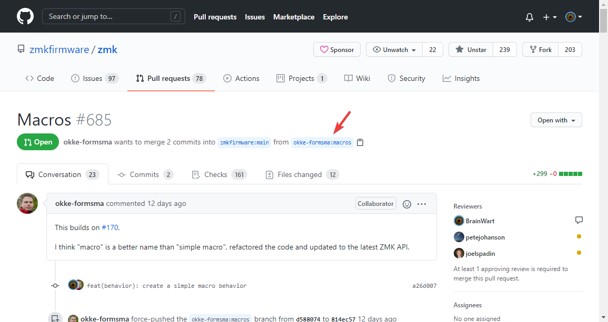
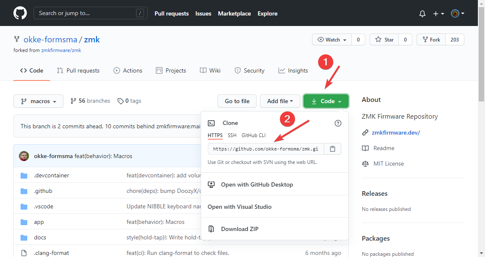
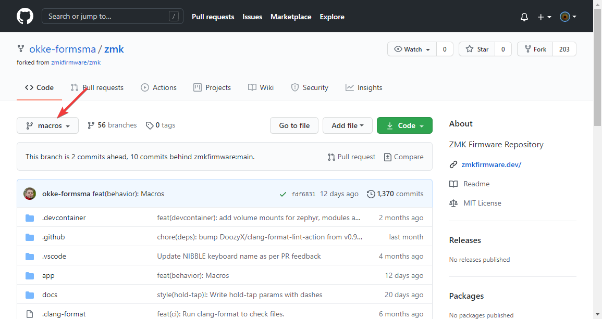

import Tabs from "@theme/Tabs";
import TabItem from "@theme/TabItem";

You may find that ZMK does not support a feature or keyboard that you are interesting in using. You may find that someone
has already taken the time to submit the feature you need as a [Pull Request](https://github.com/zmkfirmware/zmk/pulls). If you find the feature you need as a pull request,
this page is for you!

## Developer Repositories and Branches

For a developer to submit a pull request to ZMK, they must first clone the original ZMK repository. After they have a copy
of the source code, they may create a feature branch to work within. When they have finished, they will publish the feature
branch and create the pull request.

### Finding the Repository Page from the Pull Request



### Finding the Repository URL



### Finding the Repository Branch



## Testing features

Testing features will require you to modify the `west.yml` file. You will need to add a new remote for the pull request you
would like to test, and change the selected remote and revision (or branch) for the `zmk` project.

### Examples

<Tabs
defaultValue="zmk"
values={[
{label: 'Default', value: 'zmk'},
{label: 'PR685: Macros', value: 'macros'},
{label: 'PR649: Add &sleep behavior', value: 'sleep'},
]}>
<TabItem value="zmk">

```yaml
manifest:
  remotes:
    - name: zmkfirmware
      url-base: https://github.com/zmkfirmware
  projects:
    - name: zmk
      remote: zmkfirmware
      revision: main
      import: app/west.yml
  self:
    path: config
```

</TabItem>
<TabItem value="macros">

```yaml
manifest:
  remotes:
    - name: zmkfirmware
      url-base: https://github.com/zmkfirmware
    - name: okke-formsma
      url-base: https://github.com/okke-formsma
  projects:
    - name: zmk
      remote: okke-formsma
      revision: macros
      import: app/west.yml
  self:
    path: config
```

</TabItem>
<TabItem value="sleep">

```yaml
manifest:
  remotes:
    - name: zmkfirmware
      url-base: https://github.com/zmkfirmware
    - name: mcrosson
      url-base: https://github.com/mcrosson
  projects:
    - name: zmk
      remote: mcrosson
      revision: feat-behavior-sleep
      import: app/west.yml
  self:
    path: config
```

</TabItem>
</Tabs>
