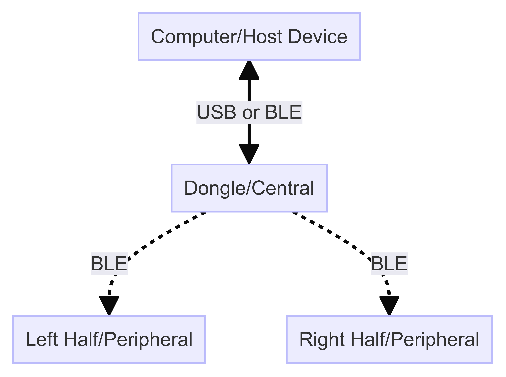
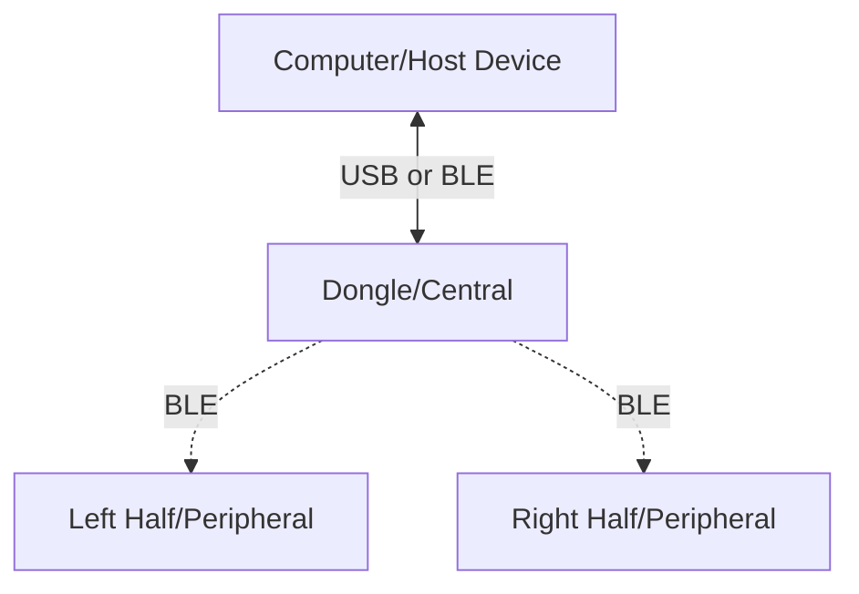

:::warning
This implementation is experimental and subject to change.
:::

ZMK split keyboards use BLE for wireless communication. These keyboards consist of two halves, each with its own microcontroller and battery. 
Usually the left half serves as the central role, communicating with the peripheral half and the host device. 
However, the central half tends to deplete its battery faster due to its connection maintenance.

To address this, a third microcontroller (the dongle) can act as the new central. It communicates with both keyboard halves (acting as peripherals). 
The dongle connects to the host device via USB, allowing the central half to draw power from the host while the peripheral halves use their own batteries, resulting in extended battery life.

The primary advantage of using a dongle is equalizing battery life for both keyboard halves. 
This ensures that both halves can operate efficiently, with some cases extending from a week to several months.




{/* Here is an example diagram of a split keyboard with a dongle:



Dotted lines represent BLE connections.
Solid lines represent USB connections. */}

:::info
For more information on how to set up a two split keyboard, refer to [New Keyboard Shield](../development/new-shield.mdx) under Guides.
After setting up the split keyboard, you can follow the steps below to add a dongle to the setup.
:::

## Benefits/Disadvantages of using a Dongle

Benefits:

- Using a dongle significantly boosts battery life for keyboard halves, as they both act as peripherals.
- Easier to connect to the host device.

Disadvantages:

- Extra microcontroller needed
- Keyboard is unusable without the dongle.
- Added latency due to the extra hop between the host device and the keyboard halves compared to a USB connected non-dongle setup.


## Defining a Dongle for a Keyboard 


:::note
In the examples below, we will be referencing the New Split Keyboard Shield guide files and will be building on top of that.
:::

### Keyboard Shield

First we will introduce a third split to our keyboard configuration. This will be used as the dongle.

```kconfig title="Kconfig.shield"
config SHIELD_MY_BOARD_DONGLE
    def_bool $(shields_list_contains,my_board_dongle)

config SHIELD_MY_BOARD_LEFT
    def_bool $(shields_list_contains,my_board_left)

config SHIELD_MY_BOARD_RIGHT
    def_bool $(shields_list_contains,my_board_right)
```

### Keyboard Defconfig

Next we will define the roles of the keyboard halves. The left and right halves will be set as peripherals, and the dongle will be set as the central.
We will also only give the central device the keyboard name.

There is also an option to still use the left half as the central, and the right half as the peripheral. In that case the dongle will not be used.


```kconfig title="Kconfig.defconfig"
if SHIELD_MY_BOARD_DONGLE

config ZMK_KEYBOARD_NAME
    default "My Board"

config ZMK_SPLIT_ROLE_CENTRAL
    default y

config ZMK_SPLIT_BLE_CENTRAL_PERIPHERALS
    default 2

# Prevent the dongle from going to sleep
config ZMK_SLEEP
    default n

# Increase the transmit power of the dongle
config BT_CLTR_TX_PWR_PLUS_8
    default y

endif

if SHIELD_MY_BOARD_LEFT
# Setting this to y will make the left half the central and the right half the peripheral
config ZMK_SPLIT_ROLE_CENTRAL
    default n

if ZMK_SPLIT_ROLE_CENTRAL
    config ZMK_KEYBOARD_NAME
        default "My Board"
endif # ZMK_SPLIT_ROLE_CENTRAL

endif

if SHIELD_MY_BOARD_DONGLE || SHIELD_MY_BOARD_LEFT || SHIELD_MY_BOARD_RIGHT

config ZMK_SPLIT
    default y

endif
```

### Dongle Overlay

In most common cases the dongle will not have any keys, in that case we can instead use a mock kscan module to simulate the keys.

Here we will define a mock kscan module with no keys and a default matrix transform.
The matrix map needs to match the keyboard halves matrix maps.

```dts title="my_board_dongle.overlay"
#include <dt-bindings/zmk/matrix_transform.h>

/ {
    chosen {
        zmk,kscan = &mock_kscan;
        zmk,matrix-transform = &default_transform;
    };

    mock_kscan: kscan_0 {
        compatible = "zmk,kscan-mock";
        columns = <0>;
        rows = <0>;
        events = <0>;
    };

    default_transform: keymap_transform_0 {
        compatible = "zmk,matrix-transform";
        columns = <3>;
        rows = <3>;
        map = <
                RC(0, 0) RC(0, 1) RC(3, 0)
                RC(1, 0) RC(1, 1) RC(1, 2)
                RC(2, 0) RC(2, 1) RC(2, 2)
        >;
    };
};
```

:::note
Without the matrix transform, the dongle will not be able to communicate with the keyboard halves.
You will get an error message similar to `zmk: No behavior assigned to 7 on layer 0`.
:::


### Building the firmware

After writing the configuration files, you can modify the `build.yml` file to include the dongle configuration.

Please keep in mind that the dongle does not have to be the same microcontroller as the keyboard halves.
Any microcontroller can be used as the dongle that supports BLE.

```yaml
include:
  - board: nice_nano_v2
    shield: my_board_left
  - board: nice_nano_v2
    shield: my_board_right
  - board: nice_nano_v2
    shield: my_board_dongle
  - board: nice_nano_v2
    shield: settings_reset
```

Start by flashing the `settings_reset` firmware on all the devices.

:::note
More information about reseting split keyboards can be found under [Troubleshooting Connection Issues](../troubleshooting/connection-issues.mdx#reset-split-keyboard-procedure)
:::
