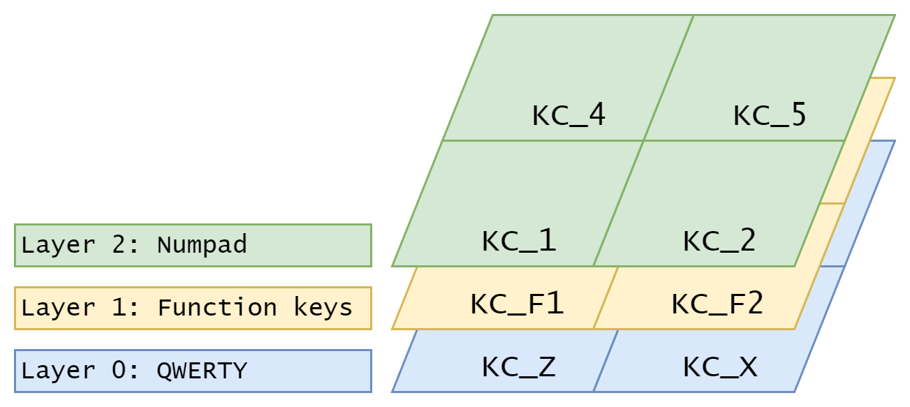

import KeymapExample from "../keymap-example.md";

ZMK uses a declarative approach to keymaps instead of using C code for all keymap configuration.
Right now, ZMK uses the devicetree syntax to declare those keymaps; future work is envisioned for
supporting dynamic loading of declarative keymaps, e.g. over USB Mass Storage or via a custom BLE
service.

:::note
For advanced users looking to implement custom behaviors for their keymaps, this will be possible
in the future by allowing user configs to add to the CMake application built by Zephyr.
:::

## Big Picture

All keyboard definitions (complete boards or shields) include the _default_ keymap for that keyboard,
so ZMK can produce a "stock" firmware for that keyboard without any further modifications. For users
looking to customize their keyboard's behavior, they can copy the stock `.keymap` file into their
user config directory, and customize the keymap to their liking.

## Behaviors

ZMK implements the concept of "behaviors", which can be bound to a certain key position, sensor (encoder),
or layer, to perform certain actions when events occur for that binding (e.g. when a certain key position
is pressed or released, or an encoder triggers a rotation event).

For example, the simplest behavior in ZMK is the "key press" behavior, which responds to key position
(a certain spot on the keyboard), and when that position is pressed, send a keycode to the host, and
when the key position is released, updates the host to notify of the keycode being released.

For the full set of possible behaviors, see the [overview page for behaviors](../behaviors/index.mdx).

## Layers

Like many mechanical keyboard firmwares, ZMK keymaps are composed of a collection of layers, with a
minimum of at least one layer that is the default, usually near the bottom of the "layer stack". Each layer
in ZMK contains a set of bindings that bind a certain behavior to a certain key position in that layer.

|                                                                                                       |
| :---------------------------------------------------------------------------------------------------------------------------------------------------------------------------: |
| _A simplified diagram showing three layers. The layout of each layer is the same (they all contain four keys), but the behavior bindings within each layer can be different._ |

All layers are assigned and referred to by a natural number, with the base layer being layer `0`. It is common to [use the C preprocessor to "name" layers](../behaviors/layers.md#defines-to-refer-to-layers), making them more legible.

The default layer (the base layer with index 0) is always enabled. Certain bound behaviors may enable/disable additional layers.

When a key location is pressed/released, the _highest-valued currently active_ layer is used. The press/release event is sent to the behavior bound at that position in said layer, for it to perform whatever actions it wants to in reaction to the event. The behavior can choose to "consume" the event, or "pass it along" and let the next highest-valued active layer _also_ get the event (whose behavior may continue "passing it along").

Note that the _activation_ order isn't relevant for determining the priority of active layers, it is determined _only_ by the definition order.

:::tip
If you wish to use multiple base layers (with a [toggle](../behaviors/layers.md#toggle-layer)), e.g. one for QWERTY and another for Colemak layouts, you will want these layers to have the lowest value possible. In other words, one should be layer `0`, and the other should be layer `1`. This allows other momentary layers activated on top of them to work with both.
:::

## Behavior Bindings

Binding a behavior at a certain key position may include up to two extra parameters that are used to
alter the behavior when that specific key position is activated/deactivated. For example, when binding
the "key press" (`kp`) behavior at a certain key position, you must specify _which_ keycode should
be used for that key position.

```dts
&kp A
```

In this case, the `A` is actually a define for the raw HID keycode, to make keymaps easier to read and write.

For example of a binding that uses two parameters, you can see how "mod-tap" (`mt`) is bound:

```dts
&mt LSHIFT D
```

Here, the first parameter is the set of modifiers that should be used for the "hold" behavior, and the second
parameter is the keycode that should be sent when triggering the "tap" behavior.

## Keymap File

A keymap file is composed of several sections, that together make up a valid devicetree file for describing the keymap and its layers.

### Includes

The devicetree files are actually preprocessed before being finally leveraged by Zephyr. This allows using standard C defines to create meaningful placeholders
for what would otherwise be cryptic integer keycodes, etc. This also allows bringing in _other_ devicetree nodes from separate files.

The top two lines of most keymaps should include:

```dts
#include <behaviors.dtsi>
#include <dt-bindings/zmk/keys.h>
```

The first defines the nodes for all the available behaviors in ZMK, which will be referenced in the behavior bindings. This is how bindings like `&kp` can reference the key press behavior defined with an anchor name of `kp`.

The second include brings in the defines for all the keycodes (e.g. `A`, `N1`, `C_PLAY`) and the modifiers (e.g. `LSHIFT`) used for various behavior bindings.

### Root Devicetree Node

All the remaining keymap nodes will be nested inside of the root devicetree node, like so:

```dts
/ {
    // Everything else goes here!
};
```

### Keymap Node

Nested under the devicetree root, is the keymap node. The node _name_ itself is not critical, but the node **MUST** have a property
`compatible = "zmk,keymap"` in order to be used by ZMK.

```dts
    keymap {
        compatible = "zmk,keymap";

        // Layer nodes go here!
    };
```

### Layers

Each layer of your keymap will be nested under the keymap node. Here is an example of a layer in a 6-key macropad.

```dts
    keymap {
        compatible = "zmk,keymap";

        default_layer { // Layer 0
// ----------------------------------------------
// |     Z     |     M     |     K     |
// |     A     |     B     |     C     |
            bindings = <
                &kp Z    &kp M    &kp K
                &kp A    &kp B    &kp C
            >;
        };
    };
```

Each layer should have:

1. A `bindings` property this will be a list of [behavior bindings](../behaviors/index.mdx), one for each key position for the keyboard.
1. (Optional) A `sensor-bindings` property that will be a list of behavior bindings for each sensor on the keyboard. (Currently, only encoders are supported as sensor hardware, but in the future devices like trackpoints would be supported the same way)

### Multiple Layers

Layers are numbered in the order that they appear in keymap node - the first layer is `0`, the second layer is `1`, etc.

Here is an example of a trio of layers for a simple 6-key macropad:

<KeymapExample />

:::note
Even if layer `1` was to be activated after `2`, layer `2` would still have priority as it is higher valued. Behaviors such as [To Layer (`&to`)](../behaviors/layers.md#to-layer) can be used to enable one layer _and disable all other non-default layers_, though.
:::

### Complete Example

Some examples of complete keymaps for a keyboard are:

- [`corne.keymap`](https://github.com/zmkfirmware/zmk/blob/main/app/boards/shields/corne/corne.keymap)
- [`kyria.keymap`](https://github.com/zmkfirmware/zmk/blob/main/app/boards/shields/kyria/kyria.keymap)
- [`lily58.keymap`](https://github.com/zmkfirmware/zmk/blob/main/app/boards/shields/lily58/lily58.keymap)

:::tip
Every keyboard comes with a "default keymap". For additional examples, the [ZMK tree's `app/boards` folder](https://github.com/zmkfirmware/zmk/blob/main/app/boards) can be browsed.
:::
