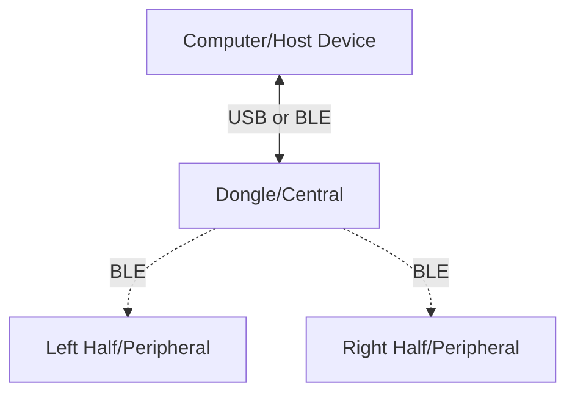

ZMK supports split keyboards that communicate wirelessly using BLE. Commonly these keyboards are split into two halves, each with its own microcontroller and battery. 
Usually the left half of the keyboard is given the split role of central, and the right half is given the split role of peripheral. 
The central half is responsible for communicating with the peripheral half and the host device.

Using this setup does have one drawback: the central half of the keyboard usually runs out of battery faster than the peripheral half. 
This is because the central half is responsible for maintaining the connection with the peripheral half and the host device.

To solve this problem, a third microcontroller can be used as the new central or as more widely known a dongle. 
For example, if you are using nice!nano v2 as your keyboard halves, you can use any other microcontroller as the dongle. 
Meaning that the dongle does not have to be the same microcontroller as the keyboard halves, but it can be.

The dongle will act as a central device and communicate with the keyboard halves which will both act as peripherals.
Dongles are usually connected to the host device using USB. This way the central half of the keyboard can be powered by the host device, 
and the peripheral halves can be powered by their own batteries. This setup allows both halves of the keyboard to have a longer battery life.


{/* Here is an example diagram of a split keyboard with a dongle:



Dotted lines represent BLE connections.
Solid lines represent USB connections. */}

:::info
For more information on how to set up a two split keyboard, refer to [New Keyboard Shield](../development/new-shield.mdx) under Guides.
After setting up the split keyboard, you can follow the steps below to add a dongle to the setup.
:::

## Benefits/Disadvantages of using a Dongle

Benefits:

- Adding a dongle, enables both keyboard halves to act as peripherals, meaning equal battery life for both halves.
- Easier to connect to the host device.

Disadvantages:

- More complex setup.
- Extra microcontroller needed
- Keyboard is unusable without the dongle.
- Added latency due to the extra hop between the host device and the keyboard halves.


## Defining a Dongle for a Keyboard 


:::note
In the examples below, we will be referencing the New Split Keyboard Shield guide files and will be building on top of that.
:::

### Keyboard Shield

First we will introduce a third split to our keyboard configuration. This will be used as the dongle.

```kconfig title="Kconfig.shield"
config SHIELD_MY_BOARD_DONGLE
    def_bool $(shields_list_contains,my_board_dongle)

config SHIELD_MY_BOARD_LEFT
    def_bool $(shields_list_contains,my_board_left)

config SHIELD_MY_BOARD_RIGHT
    def_bool $(shields_list_contains,my_board_right)
```

### Keyboard Defconfig

Next we will define the roles of the keyboard halves. The left and right halves will be set as peripherals, and the dongle will be set as the central.
We will also only give the central device the keyboard name.

For the dongle configuration we also want to specify that we are expecting 2 peripherals, one for the left half and one for the right half.
We will also set the `ZMK_SLEEP` to `n` to prevent the dongle from going to sleep. 
If the dongle is sleeping, keystrokes will not be sent to the host device, until the dongle wakes up.

Finally, we will set the `BT_CLTR_TX_PWR_PLUS_8` to `y` to increase the transmit power of the dongle.
Normally this would drain the battery faster, but since the dongle is connected to the host device, it will not be a problem.

There is also an option to still use the left half as the central, and the right half as the peripheral. In that case the dongle will not be used.


```kconfig title="Kconfig.defconfig"
if SHIELD_MY_BOARD_DONGLE

config ZMK_KEYBOARD_NAME
    default "My Board"

config ZMK_SPLIT_ROLE_CENTRAL
    default y

config ZMK_SPLIT_BLE_CENTRAL_PERIPHERALS
    default 2

config ZMK_SLEEP
    default n

config BT_CLTR_TX_PWR_PLUS_8
    default y

endif

if SHIELD_MY_BOARD_LEFT
# Setting this to y will make the left half the central and the right half the peripheral
config ZMK_SPLIT_ROLE_CENTRAL
    default n

if ZMK_SPLIT_ROLE_CENTRAL
    config ZMK_KEYBOARD_NAME
        default "My Board"
endif # ZMK_SPLIT_ROLE_CENTRAL

endif

if SHIELD_MY_BOARD_DONGLE || SHIELD_MY_BOARD_LEFT || SHIELD_MY_BOARD_RIGHT

config ZMK_SPLIT
    default y

endif
```

### Dongle Overlay

In most common cases the dongle will not have any keys, in that case we can instead use a mock kscan module to simulate the keys.

```dts title="my_board_dongle.overlay"

/ {
    chosen {
        zmk,kscan = &mock_kscan;
        // zmk,kscan = &kscan0;
    };

    mock_kscan: kscan_0 {
        compatible = "zmk,kscan-mock";
        columns = <0>;
        rows = <0>;
        events = <0>;
    };
};
```

### Building the firmware

After writing the configuration files, you can modify the `build.yml` file to include the dongle configuration.

Please keep in mind that the dongle does not have to be the same microcontroller as the keyboard halves.
Any microcontroller can be used as the dongle that supports BLE.

```yaml
include:
  - board: nice_nano_v2
    shield: my_board_left
  - board: nice_nano_v2
    shield: my_board_right
  - board: nice_nano_v2
    shield: my_board_dongle
  - board: nice_nano_v2
    shield: settings_reset
```

After creating your fresh new firmware files, 
you can go ahead and flash the settings_reset firmware for each half of the keyboard (including the dongle).
Flash the dongle firmware to the dongle and the left and right firmware to the respective halves.

:::note
More information about reseting split keyboards can be found under [Troubleshooting Connection Issues](../troubleshooting/connection-issues.mdx#reset-split-keyboard-procedure)
:::
