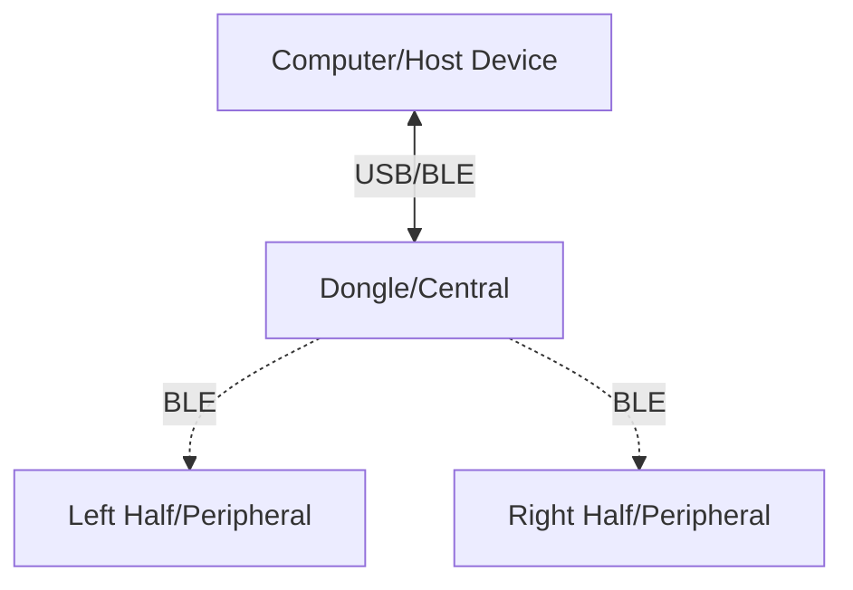

ZMK supports split keyboards that communicate wirelessly using BLE. Commonly these keyboards are split into two halves, each with its own microcontroller and battery. 
Usually the left half of the keyboard is given the split role of central, and the right half is given the split role of peripheral. 
The central half is responsible for communicating with the peripheral half and the host device.

Using this setup does have one drawback: the central half of the keyboard usually runs out of battery faster than the peripheral half. 
This is because the central half is responsible for maintaining the connection with the peripheral half and the host device.

To solve this problem, a third microcontroller can be used as the new central or as more widely known a dongle. 
The dongle will act as a central device and communicate with the keyboard halves which will both act as peripherals.
Dongles are usually connected to the host device using USB. This way the central half of the keyboard can be powered by the host device, 
and the peripheral halves can be powered by their own batteries. This setup allows both halves of the keyboard to have a longer battery life.

Here is an example diagram of a split keyboard with a dongle:



Dotted lines represent BLE connections.
Solid lines represent USB connections.

:::info
For more information on how to set up a two split keyboard, refer to [New Keyboard Shield](../development/new-shield.mdx) under Guides.
After setting up the split keyboard, you can follow the steps below to add a dongle to the setup.
:::

## Benefits/Disadvantages of using a Dongle/Split setup

Benefits:

- Longer battery life for peripheral halves of the keyboard.
- Dongle can be powered by the host device and no long wires are needed.
- Easier to connect to the host device.
- Only the central side needs to reflashed for keymap updates

Disadvantages:

- More complex setup.
- More components needed.
- Added latency due to the extra hop between the host device and the keyboard halves.
- Each half of the keyboard needs its own firmware (ex: left, right, and dongle).

:::warning[Reset/Bootloader behavior]
When using a combo to trigger reset/bootloader, only the central side will be affected. To avoid this, you can avoid using the combo and instead use a physical reset button on the central half.
That will allow you to locally reset the central/peripheral side without affecting other halves.
:::

## Building a Split Keyboard shield with a Dongle

:::note
Because we will be changing the roles of the keyboard halves, we will also need to flash the reset firmware to the keyboard halves.
Information about the reset firmware can be found under Troubleshooting [Reset firmware](../troubleshooting/connection-issues.mdx#acquiring-a-reset-uf2)
:::

### Kconfig.shield

First we will introduce a third split to our keyboard configuration. This will be used as the dongle.

```kconfig
config SHIELD_MY_BOARD_DONGLE
    def_bool $(shields_list_contains,my_board_dongle)

config SHIELD_MY_BOARD_LEFT
    def_bool $(shields_list_contains,my_board_left)

config SHIELD_MY_BOARD_RIGHT
    def_bool $(shields_list_contains,my_board_right)
```

### Kconfig.defconfig

Next we will define the roles of the keyboard halves. The left and right halves will be set as peripherals, and the dongle will be set as the central.
We will also only give the dongle the keyboard name.

```kconfig
if SHIELD_MY_BOARD_DONGLE

config ZMK_KEYBOARD_NAME
    default "My Board"

config ZMK_SPLIT_ROLE_CENTRAL
    default y

endif

if SHIELD_MY_BOARD_DONGLE || SHIELD_MY_BOARD_LEFT || SHIELD_MY_BOARD_RIGHT

config ZMK_SPLIT
    default y

endif
```

### Dongle configuration

Finally, we will define the dongle configuration. We want to set the number of peripherals to 2 and disable sleep mode for the dongle since it will be connected to the host device.
In case you want to use the dongle with a battery, you can enable sleep mode for the dongle. Since the dongle will be connected to the host device, we will also increase the broadcast power.

```ini title="my_board_dongle.conf"
CONFIG_ZMK_SPLIT_BLE_CENTRAL_PERIPHERALS=2

CONFIG_ZMK_SLEEP=n
# Uncomment if sleep is enabled
# CONFIG_ZMK_IDLE_SLEEP_TIMEOUT=3600000
# Make the dongle broadcast with more power
CONFIG_BT_CTLR_TX_PWR_PLUS_8=y
```

### Dongle Overlay

In most common cases the dongle will not have any keys, in that case we can instead use a mock kscan module to simulate the keys.

```dts title="my_board_dongle.overlay"

/ {
    chosen {
        zmk,kscan = &mock_kscan;
        // zmk,kscan = &kscan0;
    };

    mock_kscan: kscan_0 {
        compatible = "zmk,kscan-mock";
        columns = <0>;
        rows = <0>;
        events = <0>;
    };
};
```