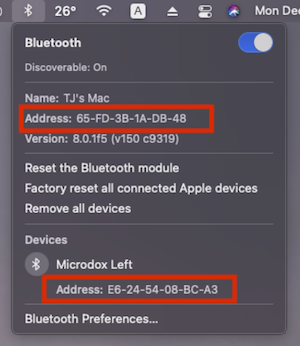
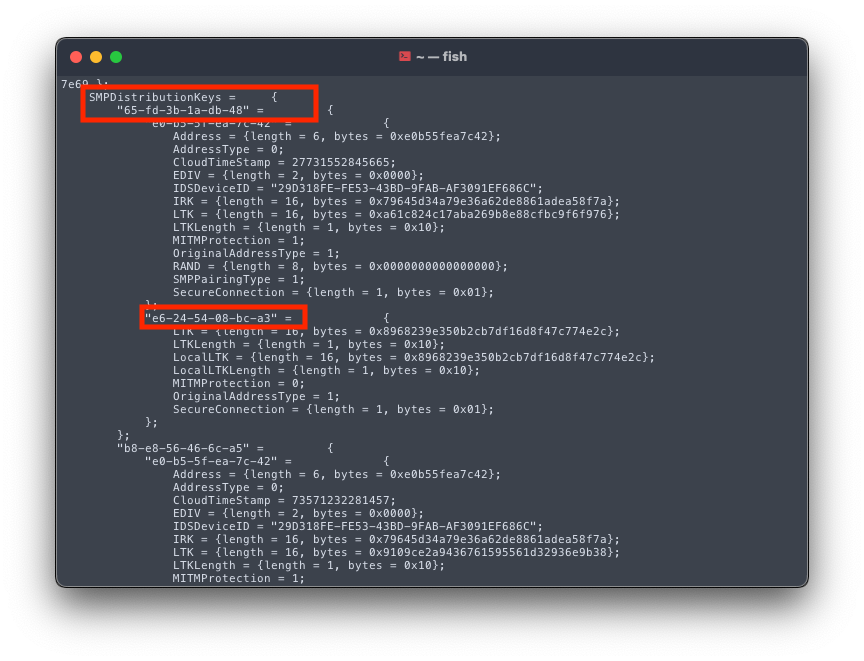
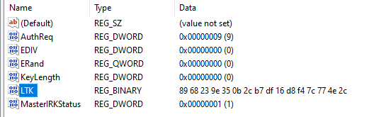
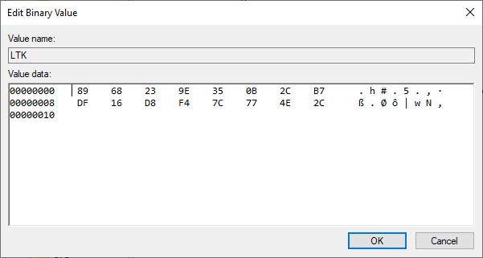

import Tabs from '@theme/Tabs';
import TabItem from '@theme/TabItem';

### Summary

The following page provides suggestions for common errors that may occur during firmware compilation. If the information provided is insufficient to resolve the issue, feel free to seek out help from the [ZMK Discord](https://zmkfirmware.dev/community/discord/invite).

### File Transfer Error

Variations of the warnings shown below occur when flashing the `<firmware>.uf2` onto the microcontroller. This is because the microcontroller resets itself before the OS receives confirmation that the file transfer is complete. Errors like this are normal and can generally be ignored. Verification of a functional board can be done by attempting to pair your newly flashed keyboard to your computer via Bluetooth or plugging in a USB cable if `ZMK_USB` is enabled in your Kconfig.defconfig.

|  |
| :------------------------------------------------------------------------------: |
|               An example of the file transfer error on Windows 10                |

|  |
| :----------------------------------------------------------------------------: |
|                 An example of the file transfer error on Linux                 |

|  |
| :--------------------------------------------------------------------------: |
|                An example of the file transfer error on MacOS                |

### CMake Error

An error along the lines of `CMake Error at (zmk directory)/zephyr/cmake/generic_toolchain.cmake:64 (include): include could not find load file:` during firmware compilation indicates that the Zephyr Environment Variables are not properly defined.
For more information, click [here](../docs/development/setup#environment-variables).

### dtlib.DTError

An error along the lines of `dtlib.DTError: <board>.dts.pre.tmp:<line number>` during firmware compilation indicates an issue within the `<shield>.keymap` file.
This can be verified by checking the file in question, found in `mkdir/app/build`.

|                                     |
| :----------------------------------------------------------------------------------------------------------------: |
| An example of the dtlib.DTError when compiling an iris with the nice!nano while the keymap is not properly defined |

After opening the `<board>.dts.pre.tmp:<line number>` and scrolling down to the referenced line, one can locate errors within their shield's keymap by checking if the referenced keycodes were properly converted into the correct [USB HID Usage ID](https://www.usb.org/document-library/hid-usage-tables-12).

|                                                                                                                                      |
| :--------------------------------------------------------------------------------------------------------------------------------------------------------------------------------------------------------------------: |
| An incorrectly defined keymap unable to compile. As shown in red, `&kp SPAC` is not a valid reference to the [USB HID Usage ID](https://www.usb.org/document-library/hid-usage-tables-12) used for "Keyboard Spacebar" |

|                                                                                                                                                              |
| :----------------------------------------------------------------------------------------------------------------------------------------------------------------------------------------------------------------------------------------: |
| A properly defined keymap with successful compilation. As shown in red, the corrected keycode (`&kp SPACE`) references the proper Usage ID defined in the [USB HID Usage Tables](https://www.usb.org/document-library/hid-usage-tables-12) |

### Split Keyboard Halves Unable to Pair

Previously, pairing split keyboard halves involved a **BLE Reset** via a combination of held keys that removed all bluetooth profile information from the keyboard.
Since then, a much simpler procedure of performing a bluetooth reset for split keyboards has come about, without the need for any file modification:

**New Procedure:**

1. Log into Github and download the "settings clear" UF2 image from the [latest build in Github Actions](https://github.com/zmkfirmware/zmk/actions?query=workflow%3ABuild+branch%3Amain)
1. Put each half of the split keyboard into bootloader mode
1. Flash one of the halves of the split with the "settings clear" UF2 image from step 1. Immediately after flashing "settings clear" to the chosen half, immediately put it into bootloader mode
   to avoid accidental bonding between the halves.
1. Repeat step 3 with the other half of the split keyboard
1. Flash the actual image for each half of the split keyboard (e.g `my_board_left.uf2` to the left half, `my_board_right.uf2` to the right half)

After completing these steps, pair the halves of the split keyboard together by resetting them at the same time. Most commonly, this is done by grounding the reset pins
for each of your keyboard's microcontrollers or pressing the reset buttons at the same time.

### Connectivity Issues

Some users may experience a poor connection between the keyboard and the host. This might be due to poor quality BLE hardware, a metal enclosure on the keyboard or host, or the distance between them. Increasing the transmit power of the keyboard's BLE radio may reduce the severity of this problem. To do this, set the `CONFIG_BT_CTLR_TX_PWR_PLUS_8` configuration value in the `.conf` file of your user config directory as such:

```
CONFIG_BT_CTLR_TX_PWR_PLUS_8=y
```

For the `nRF52840`, the value `PLUS_8` can be set to any multiple of four between `MINUS_20` and `PLUS_8`. The default value for this config is `0`, but if you are having connection issues it is recommended to set it to `PLUS_8` because the power consumption difference is negligible. For more information on changing the transmit power of your BLE device, please refer to [the Zephyr docs.](https://docs.zephyrproject.org/latest/reference/kconfig/CONFIG_BT_CTLR_TX_PWR_PLUS_8.html)

### MacOS/Windows Dual Booting

If you are utiizing Apple's BootCamp feature or running a hackintosh that allows you to easily dual-boot your system between macOS and Windows, you will find that you can only use your bluetooth devices on one OS or the other without re-pairing. This is because ZMK stores the host address and keys in the profiles only one time. This means that a host can only pair with exactly one ZMK profile.

The workaround for this limitation is as follows:

1. First, boot into Windows and pair your device. This creates the registry entry we will need to edit later on.
1. Reboot into macOS
1. In macOS, clear the profile on your keyboard and pair with your computer.
1. Once paired, hold Option + Control + Shift and click on the bluetooth icon in your menubar. Take note of the "Address" of your computer's bluetooth device (`65-FD-3B-1A-DB-48` here), as well as the address of the connected device (`E6-24-54-08-BC-A3` here).

   |  |
   | :-----------------------------------------------------------------------------: |
   |                             Bluetooth Context Menu                              |

1. Now open the terminal app (Applications/Utilities/Terminal.app) and paste the following command and enter your root password.

   <Tabs
   defaultValue="HS"
   values={[
   {label: 'macOS High Sierra (10.13) and newer', value: 'high_sierra'},
   {label: 'macOS Sierra (10.12) and older', value: 'sierra'},
   ]}>
   <TabItem value="high_sierra">

   ```
   sudo defaults read /private/var/root/Library/Preferences/com.apple.bluetoothd.plist
   ```

      </TabItem>
      <TabItem value="sierra">

   ```
   sudo defaults read /private/var/root/Library/Preferences/blued.plist
   ```

   </TabItem>
   </Tabs>

   This will print the contents of the bluetooth plist file containing the pairing keys for your bluetooth devices.

   |  |
   | :------------------------------------------------------------: |
   |                        Bluetooth .plist                        |

1. Look for the section that starts with `SMPDistributionKeys =`. Below this, find your host's bluetooth address (`65-FD-3B-1A-DB-48` in this example) and then look for the address of your keyboard (`E6-24-54-08-BC-A3` in this example).
1. Under your keyboard address, find the value labeled LocalLTK (in the screenshot above it is `0x8968239e350b2cb7df16d8f47c774e2c`). Copy this value into a text file that you can access from Windows, this is the value we will need to enter into the registry later on.
1. Reboot into Windows
1. Once logged in, turn off bluetooth.
1. Grab a piece of software called psexec (https://docs.microsoft.com/en-us/sysinternals/downloads/psexec), extract, and copy psexec.exe to the desktop. This will allow us to easily open Regedit with elevated privelages.

   :::warning Registry Edits Can Brick Your Computer

   While this procedure has been tested and verified, any time edits are made to the registry, irreparable damage to your system is possible. Proceed with caution.

   :::

1. Open the Start Menu, type `cmd` and hit control + shift + enter to launch an elevated command prompt.
1. Enter the following, one at a time:

   ```
   cd c:\Users\<username>\Desktop
   psexec -s -i regedit
   ```

   Regedit will launch. Be careful in here as certain registry edits can cause your system to become unstable or unbootable! Edit only the entry shown in this guide.

1. Navigate in the registry to this key

   ```
   HKEY_LOCAL_MACHINE\SYSTEM\CurrentControlSet\Services\BTHPORT\Parameters\Keys\
   ```

1. Inside "Keys", select the address of your host bluetooth device. It should be the same as it was in macOS (`65-FD-3B-1A-DB-48` in this example).
1. Below that, find the address that matches your keyboard's from macOS (`E6-24-54-08-BC-A3` in this example).

   |  |
   | :--------------------------------------------------------------------: |
   |                              Registry Key                              |

1. Under that, there should be a registry entry called "LTK". Double click on this entry to modify it. Regedit will pop up a hex editing window. Delete the contents to start with a blank value. Refer to the LocalLTK value you saved from macOS and enter it into this dialog box, omitting the "0x" at the beginning. Regedit will automatically advance you through the hex pairs. When you're done the window should look something like this:

   |  |
   | :-------------------------------------------------------------------------: |
   |                             Registry Key Editor                             |

1. Select OK, exit Regedit, and reboot into Windows.
1. Once rebooted, turn bluetooth back on, and make sure your keyboard is on the same profile you had selected in macOS. Your keyboard should connect and start working!
1. Finally reboot into macOS and verify that your keyboard still works on the same profile here as well.

If your board still does not work in one OS or the other, start over at the beginning with a clean pairing in each OS.
git e
