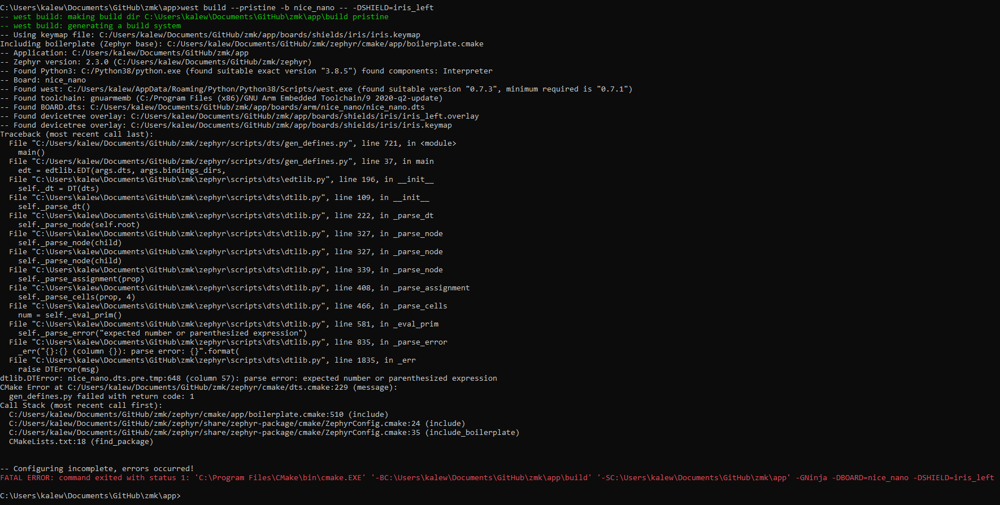
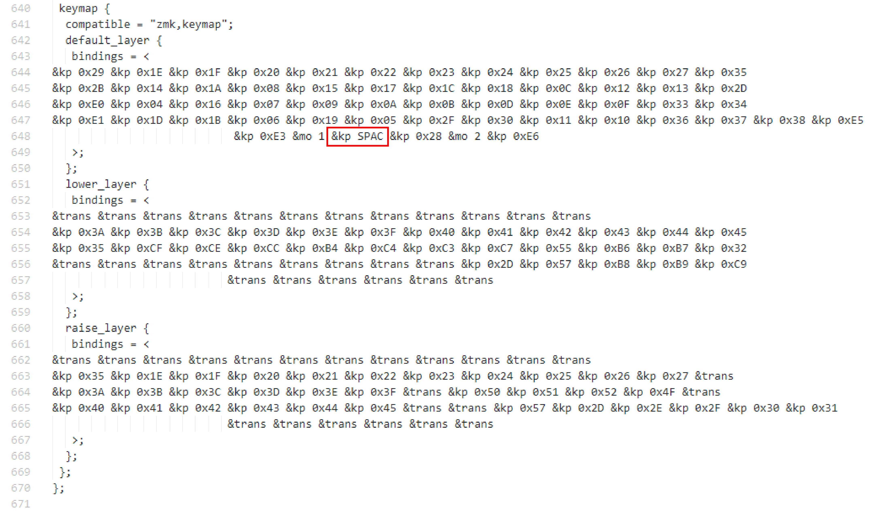
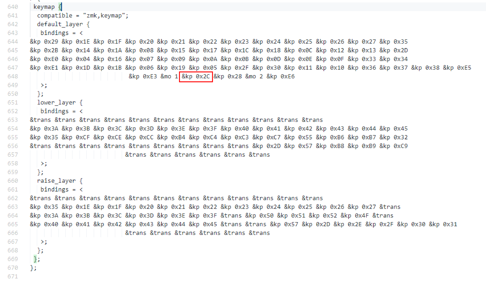

### Summary

The following page provides suggestions for common errors that may occur during firmware compilation. If the information provided is insufficient to resolve the issue, feel free to seek out help from the [ZMK Discord](https://zmk.dev/community/discord/invite).

### File Transfer Error

Variations of the warnings shown below occur when flashing the `<firmware>.uf2` onto the microcontroller. This is because the microcontroller resets itself before the OS receives confirmation that the file transfer is complete. Errors like this are normal and can generally be ignored. Verification of a functional board can be done by attempting to pair your newly flashed keyboard to your computer via Bluetooth or plugging in a USB cable if `ZMK_USB` is enabled in your Kconfig.defconfig.

|  |
| :------------------------------------------------------------------------------: |
|               An example of the file transfer error on Windows 10                |

|  |
| :----------------------------------------------------------------------------: |
|                 An example of the file transfer error on Linux                 |

|  |
| :--------------------------------------------------------------------------: |
|                An example of the file transfer error on MacOS                |

### CMake Error

An error along the lines of `CMake Error at (zmk directory)/zephyr/cmake/generic_toolchain.cmake:64 (include): include could not find load file:` during firmware compilation indicates that the Zephyr Environment Variables are not properly defined.
For more information, click [here](../docs/development/setup.md#environment-variables).

### dtlib.DTError

An error along the lines of `dtlib.DTError: <board>.dts.pre.tmp:<line number>` during firmware compilation indicates an issue within the `<shield>.keymap` file.
This can be verified by checking the file in question, found in `mkdir/app/build`.

|                                     |
| :----------------------------------------------------------------------------------------------------------------: |
| An example of the dtlib.DTError when compiling an iris with the nice!nano while the keymap is not properly defined |

After opening the `<board>.dts.pre.tmp:<line number>` and scrolling down to the referenced line, one can locate errors within their shield's keymap by checking if the referenced keycodes were properly converted into the correct [USB HID Usage ID](https://www.usb.org/document-library/hid-usage-tables-12).

|                                                                                                                                      |
| :--------------------------------------------------------------------------------------------------------------------------------------------------------------------------------------------------------------------: |
| An incorrectly defined keymap unable to compile. As shown in red, `&kp SPAC` is not a valid reference to the [USB HID Usage ID](https://www.usb.org/document-library/hid-usage-tables-12) used for "Keyboard Spacebar" |

|                                                                                                                                                              |
| :----------------------------------------------------------------------------------------------------------------------------------------------------------------------------------------------------------------------------------------: |
| A properly defined keymap with successful compilation. As shown in red, the corrected keycode (`&kp SPACE`) references the proper Usage ID defined in the [USB HID Usage Tables](https://www.usb.org/document-library/hid-usage-tables-12) |

### Split Keyboard Halves Unable to Pair

Previously, pairing split keyboard halves involved a **BLE Reset** via a combination of held keys that removed all bluetooth profile information from the keyboard.
Since then, a much simpler procedure of performing a bluetooth reset for split keyboards has come about, without the need for any file modification:

**New Procedure:**

1. [Open the GitHub `Actions` tab and select the `Build` workflow](https://github.com/zmkfirmware/zmk/actions?query=workflow%3ABuild+branch%3Amain+event%3Apush).
1. Select the top 'result' on that page.
1. From the next page under "Artifacts", download the `$boardname-settings_reset-zmk` zip file.
1. Unzip the downloaded file.
1. Put each half of the split keyboard into bootloader mode
1. Flash one of the halves of the split with the "settings clear" UF2 image from step 1. Immediately after flashing "settings clear" to the chosen half, immediately put it into bootloader mode
   to avoid accidental bonding between the halves.
1. Repeat step 3 with the other half of the split keyboard
1. Flash the actual image for each half of the split keyboard (e.g `my_board_left.uf2` to the left half, `my_board_right.uf2` to the right half)

After completing these steps, pair the halves of the split keyboard together by resetting them at the same time. Most commonly, this is done by grounding the reset pins
for each of your keyboard's microcontrollers or pressing the reset buttons at the same time.

### Connectivity Issues

Some users may experience a poor connection between the keyboard and the host. This might be due to poor quality BLE hardware, a metal enclosure on the keyboard or host, or the distance between them. Increasing the transmit power of the keyboard's BLE radio may reduce the severity of this problem. To do this, set the `CONFIG_BT_CTLR_TX_PWR_PLUS_8` configuration value in the `.conf` file of your user config directory as such:

```
CONFIG_BT_CTLR_TX_PWR_PLUS_8=y
```

For the `nRF52840`, the value `PLUS_8` can be set to any multiple of four between `MINUS_20` and `PLUS_8`. The default value for this config is `0`, but if you are having connection issues it is recommended to set it to `PLUS_8` because the power consumption difference is negligible. For more information on changing the transmit power of your BLE device, please refer to [the Zephyr docs.](https://docs.zephyrproject.org/latest/reference/kconfig/CONFIG_BT_CTLR_TX_PWR_PLUS_8.html)
