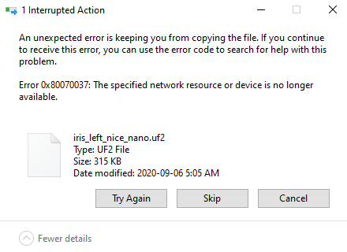
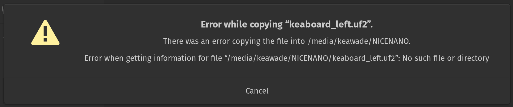
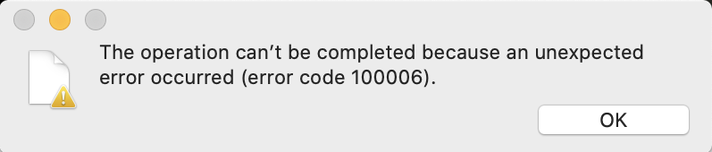
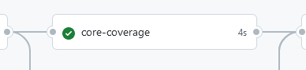

The following page provides suggestions for common errors that may occur during firmware compilation or other issues with keyboard usage. If the information provided is insufficient to resolve the issue, feel free to seek out help from the [ZMK Discord](https://zmk.dev/community/discord/invite).

Please also see [the troubleshooting section](features/bluetooth.md#troubleshooting) under the Bluetooth feature page for issues related to bluetooth.

### File Transfer Error

Variations of the warnings shown below occur when flashing the `<firmware>.uf2` onto the microcontroller. This is because the microcontroller resets itself before the OS receives confirmation that the file transfer is complete. Errors like this are normal and can generally be ignored. Verification of a functional board can be done by attempting to pair your newly flashed keyboard to your computer via Bluetooth or plugging in a USB cable if `ZMK_USB` is enabled in your Kconfig.defconfig.

|  |
| :------------------------------------------------------------------------------: |
|               An example of the file transfer error on Windows 10                |

|  |
| :----------------------------------------------------------------------------: |
|                 An example of the file transfer error on Linux                 |

|  |
| :--------------------------------------------------------------------------: |
|                An example of the file transfer error on macOS                |

### macOS Ventura error

macOS 13.0 (Ventura) Finder may report an error code 100093 when copying `<firmware>.uf2` files into microcontrollers. This bug is limited to the operating system's Finder. You can work around it by copying on Terminal command line or use a third party file manager. Issue is fixed in macOS version 13.1.

### CMake Error

An error along the lines of `CMake Error at (zmk directory)/zephyr/cmake/generic_toolchain.cmake:64 (include): include could not find load file:` during firmware compilation indicates that the Zephyr Environment Variables are not properly defined.
For more information, click [here](../docs/development/setup.md#environment-variables).

### West Build Errors

West build errors usually indicate syntax problems in the `<keyboard>.keymap` file during the compilation process. The following are some examples and root causes.

:::note
If you are reviewing these errors in the GitHub Actions tab, they can be found in the `West Build` step of the build process.
:::

#### devicetree error

A `devicetree error` followed by a reference to the line number on `<keyboard>.keymap` refers to an issue at the exact line position in that file. For example, below error message indicates a missing `;` at line 109 of the `cradio.keymap` file:

```
devicetree error: /__w/zmk-config/zmk-config/config/cradio.keymap:109 (column 4): parse error: expected ';' or ','
```

#### devicetree_unfixed.h error

A `devicetree_unfixed.h` error that follows with an "undeclared here" string indicates a problem with key bindings, like behavior nodes (e.g. `&kp` or `&mt`) with incorrect number of parameters:

```
/__w/zmk-config/zmk-config/build/zephyr/include/generated/devicetree_unfixed.h:3756:145: error: 'DT_N_S_keymap_S_symbol_layer_P_bindings_IDX_12_PH_P_label' undeclared here (not in a function); did you mean 'DT_N_S_keymap_S_symbol_layer_P_bindings_IDX_16_PH'?
```

In this example, the error string `DT_N_S_keymap_S_symbol_layer_P_bindings_IDX_12_PH_P_label` indicates a problem with the key binding in position `12` in the `symbol_layer` of the keymap.

:::info
Key positions are numbered starting from `0` at the top left key on the keymap, incrementing horizontally, row by row.
:::

:::tip
A common mistake that leads to this error is to use [key press keycodes](behaviors/key-press.md) without the leading `&kp` binding. That is, having entries such as `SPACE` that should have been `&kp SPACE`.
:::

### Split Keyboard Halves Unable to Pair

Split keyboard halves pairing issue can be resolved by flashing a settings reset firmware to both controllers. You will first need to acquire the reset UF2 image file with one of the following options:

#### Option 1: Build Reset UF2 in 'zmk-config'

Find the `build.yaml` file in your `zmk-config` folder and add an additional settings reset build for the board used by your split keyboard. For example assuming that the config repo is setup for nice!nano v2 with Corne, append the `settings_reset` shield to the `build.yaml` file as follows:

```yml
include:
  - board: nice_nano_v2
    shield: corne_left
  - board: nice_nano_v2
    shield: corne_right
  - board: nice_nano_v2
    shield: settings_reset
```

Save the file, commit the changes and push them to GitHub. Download the new firmware zip file build by the latest GitHub Actions job. In it you will find an additional `settings_reset` UF2 image file.

#### Option 2: Download Reset UF2 from ZMK's Workflow

1. [Open the GitHub `Actions` tab and select the `Build` workflow](https://github.com/zmkfirmware/zmk/actions?query=workflow%3ABuild+branch%3Amain+event%3Apush).
1. Find one of the 'results' for which the core-coverage job was successfully run, indicated by a green checkmark in the core-coverage bubble like the image example below.
1. From the next page under "Artifacts", download and unzip the `<board_name>-settings_reset-zmk` zip file for the UF2 image.

|  |
| :-------------------------------------------------------------------------------------------: |
|  An example of a successful core-coverage job which will produce a settings_reset firmware.   |

#### Reset Split Keyboard Procedure

Perform the following steps to reset both halves of your split keyboard:

1. Put each half of the split keyboard into bootloader mode.
1. Flash one of the halves of the split with the downloaded settings reset UF2 image. Immediately after flashing the chosen half, put it into bootloader mode to avoid accidental bonding between the halves.
1. Repeat step 2 with the other half of the split keyboard.
1. Flash the actual image for each half of the split keyboard (e.g `my_board_left.uf2` to the left half, `my_board_right.uf2` to the right half).

After completing these steps, pair the halves of the split keyboard together by resetting them at the same time. Most commonly, this is done by grounding the reset pins for each of your keyboard's microcontrollers or pressing the reset buttons at the same time.
