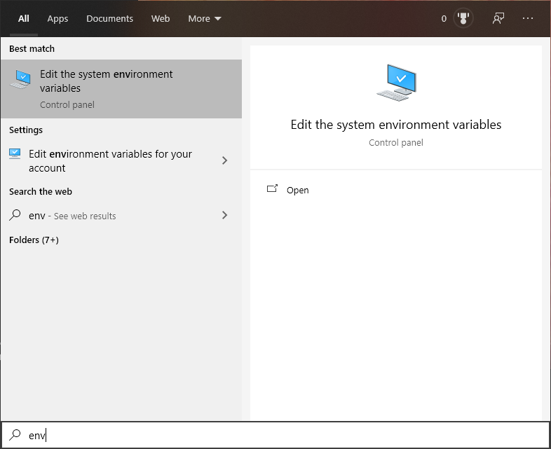
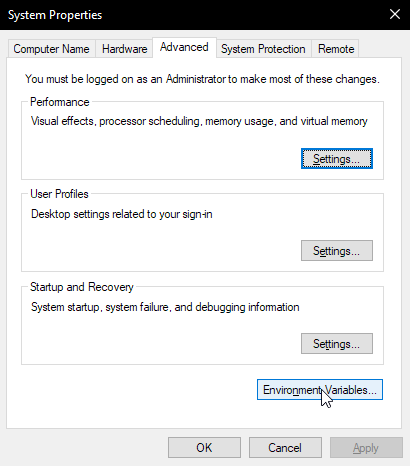
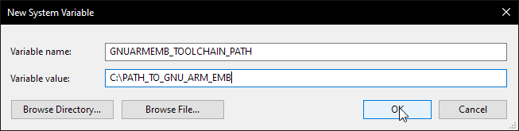
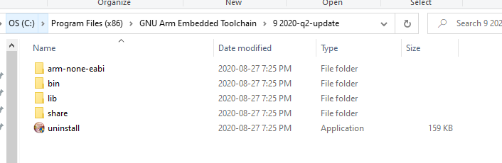

import Tabs from '@theme/Tabs';
import TabItem from '@theme/TabItem';

export const OsTabs = (props) => (<Tabs
groupId="operating-systems"
defaultValue="debian"
values={[
{label: 'Debian/Ubuntu', value: 'debian'},
{label: 'Raspberry OS', value: 'raspberryos'},
{label: 'Fedora', value: 'fedora'},
{label: 'Windows', value: 'win'},
{label: 'macOS', value: 'mac'},
]
}>{props.children}</Tabs>);

### Environment Variables not Defined

An error along the lines of `CMake Error at (zmk directory)/zephyr/cmake/generic_toolchain.cmake:64 (include): include could not find load file:` during firmware compilation indicates that the Zephyr Environment Variables are not properly defined.

|   |
| :-------------------------------------------------------------------------------:      |
|            An example of the CMake Error on Windows 10                                 |

<OsTabs>

<TabItem value="debian">
To be completed!
</TabItem>

<TabItem value="raspberryos">
To be completed!
</TabItem>

<TabItem value="fedora">
To be completed!
</TabItem>

<TabItem value="win">

On Windows 10, navigate to the System Environment Variables page using the search bar.

Click the button labelled 'Environment Variables'

Add a new System Variable labelled `ZEPHYR_TOOLCHAIN_VARIANT` with a value of `gnuarmemb`.

Repeat the previous steps to create another System Variable called `GNUARMEMB_TOOLCHAIN_PATH` with a value of the directory containing the GNU Arm Embedded Toolchain. 

:::note
The folder for the GNUARMEMB_TOOLCHAIN_PATH should look something like this inside:

:::

Restart any terminals used to build firmware to check if the errors have been resolved.

</TabItem>

<TabItem value="mac">
To be completed!
</TabItem>

</OsTabs>

### Improperly defined keymap

An error along the lines of `dtlib.DTError: BOARDNAME.dts.pre.tmp:LINENUMBER` during firmware compilation indicates an issue within the `shield.keymap` file.
This can be verified by checking the file in question, found in `mkdir/app/build`.

|                                                    |
| :-------------------------------------------------------------------------------:                                                 |
|            An example of the dtlib.DTError when compiling an iris with the nice!nano while the keymap is not properly defined     |

After opening the `BOARDNAME.dts.pre.tmp:LINENUMBER` and scrolling down to the referenced line, one can locate errors within their shield's keymap by checking if the referenced keycodes were properly converted into the correct [USB HID Usage ID](https://www.usb.org/document-library/hid-usage-tables-12).

|         |
| :-------------------------------------------------------------------------------: |
| An incorrectly defined keymap unable to compile. As shown in red, `&kp SPAC` is not a valid 
reference to the [USB HID Usage ID](https://www.usb.org/document-library/hid-usage-tables-12) used for "Keyboard Spacebar"       |

|    |
| :-------------------------------------------------------------------------------: |
|  A properly defined keymap with successful compilation. As shown in red, the corrected keycode (`&kp SPC`) references the proper Usage ID defined in the [USB HID Usage Tables](https://www.usb.org/document-library/hid-usage-tables-12)|