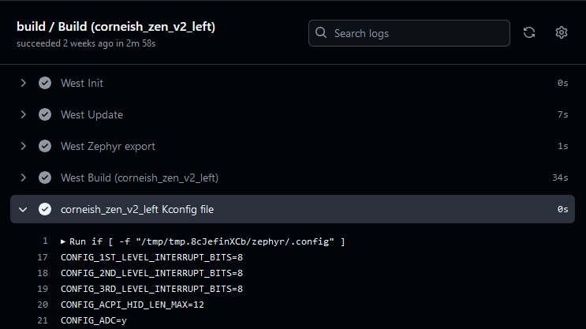
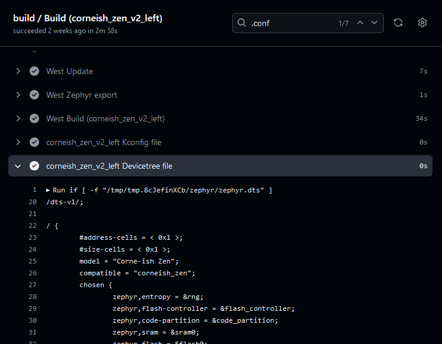

## CMake Error

An error along the lines of `CMake Error at (zmk directory)/zephyr/cmake/generic_toolchain.cmake:64 (include): include could not find load file:` during firmware compilation indicates that the Zephyr Environment Variables are not properly defined.
For more information, see [Zephyr's CMake Package](https://docs.zephyrproject.org/3.5.0/build/zephyr_cmake_package.html).

## West Build Errors

West build errors usually indicate syntax problems in the `<keyboard>.keymap` file during the compilation process. The following are some examples and root causes.

:::note
If you are reviewing these errors in the GitHub Actions tab, they can be found in the `West Build` step of the build process.
:::

### Keymap Error

If you get an error stating `Keymap node not found, check a keymap is available and is has compatible = "zmk,keymap" set` this is an indication that the build process cannot find the keymap. Double check that the `<keyboard>.keymap` file is present and has been discovered by the build process. This can be checked by looking for a line in the build log stating `-- Using keymap file: /path/to/keymap/file/<keyboard>.keymap`. Inside the keymap file ensure the keymap node has `compatible = zmk,keymap` and it's not misspelled. For more information see the [Keymaps](keymaps/index.mdx) and [Config](config/index.md) documentation.

### Devicetree Errors

#### "parse error"

A `devicetree error` followed by a reference to the line number on `<keyboard>.keymap` refers to an issue at the exact line position in that file. For example, below error message indicates a missing `;` at line 109 of the `cradio.keymap` file:

```
devicetree error: /__w/zmk-config/zmk-config/config/cradio.keymap:109 (column 4): parse error: expected ';' or ','
```

Note that the provided number for the column corresponds to the numbering after the preprocessor expansion and it will likely not match the column numbers in your keymap.

#### "lacks #binding-cells"

A `devicetree error` followed by an `empty_file.c` reference with `lacks #binding-cells` string indicates possible problems with improper parameters for specific bindings:

```
devicetree error: <Node /soc/gpio@50000300 in '/tmp/tmp.vJq9sMwkcY/zephyr/misc/empty_file.c'> lacks #binding-cells
```

This error can be triggered by incorrect binding syntax such as `&kp BT_SEL 0` instead of `&bt BT_SEL 0`.

#### "devicetree_generated.h[...] undeclared here"

A `devicetree_generated.h` error that follows with an "undeclared here" string indicates a problem with key bindings, like behavior nodes (e.g. `&kp` or `&mt`) with incorrect number of parameters:

```
/__w/zmk-config/zmk-config/build/zephyr/include/generated/devicetree_generated.h:3756:145: error: 'DT_N_S_keymap_S_symbol_layer_P_bindings_IDX_12_PH_P_label' undeclared here (not in a function); did you mean 'DT_N_S_keymap_S_symbol_layer_P_bindings_IDX_16_PH'?
```

In this example, the error string `DT_N_S_keymap_S_symbol_layer_P_bindings_IDX_12_PH_P_label` indicates a problem with the key binding in position `12` in the `symbol_layer` of the keymap.

:::info
Key positions are numbered starting from `0` at the top left key on the keymap, incrementing horizontally, row by row.
:::

:::tip
A common mistake that leads to this error is to use [key press keycodes](keymaps/behaviors/key-press.md) without the leading `&kp` binding. That is, having entries such as `SPACE` that should have been `&kp SPACE`.
:::

## Diagnosing Unexpected Build Results

### Configuration Setting Issues

If you want to ensure that the [configuration settings](../config/index.md#kconfig-files) you intend to change are changed in the build, you can check the final compiled Kconfig file that the firmware build process produces.
This file will display values for all set configurations and includes user, board, shield (if used in build), ZMK, and Zephyr-level settings.

When using GitHub Actions to build your firmware, the contents of this file are displayed in the "`<keyboard>` Kconfig file" step in your build job:



If you are building locally, this file can be found inside the build folder at `<build_folder>/zephyr/.config`.

Additionally, the build command (in "West Build (`<keyboard>`)" step in GitHub Actions) logs what configuration files were found and used in the build:

```
+ west build -s zmk/app -d /tmp/tmp.8cJefinXCb -b corneish_zen_v2_left -- -DZMK_CONFIG=/tmp/zmk-config/config -DZMK_EXTRA_MODULES=/__w/zmk-config/zmk-config
...
-- ZMK Config Kconfig: /tmp/zmk-config/config/corneish_zen.conf
...
```

### Devicetree-related Issues

If you want to ensure that your [devicetree files](../config/index.md#devicetree-files) are processed as you expect, you can check the final compiled devicetree file that the firmware build process produces.
This file will contain a single devicetree that combines all of user, board, and shield (if used in build) devicetree files.
Note that while it will include your keymap contents in it, [keycodes](../keymaps/list-of-keycodes.mdx) like `SPACE` will be displayed instead as hexadecimal numbers like `0x7002a`.

When using GitHub Actions to build your firmware, the contents of this file are displayed in the "`<keyboard>` Devicetree file" step in your build job:



If you are building locally, this file can be found inside the build folder at `<build_folder>/zephyr/zephyr.dts`.

Additionally, the build command (in "West Build (`<keyboard>`)" step in GitHub Actions) logs what devicetree files were found and used in the build:

```
+ west build -s zmk/app -d /tmp/tmp.8cJefinXCb -b corneish_zen_v2_left -- -DZMK_CONFIG=/tmp/zmk-config/config -DZMK_EXTRA_MODULES=/__w/zmk-config/zmk-config
...
-- Found BOARD.dts: /tmp/zmk-config/zmk/app/boards/arm/corneish_zen/corneish_zen_v2_left.dts
-- Found devicetree overlay: /tmp/zmk-config/config/corneish_zen.keymap
...
```
