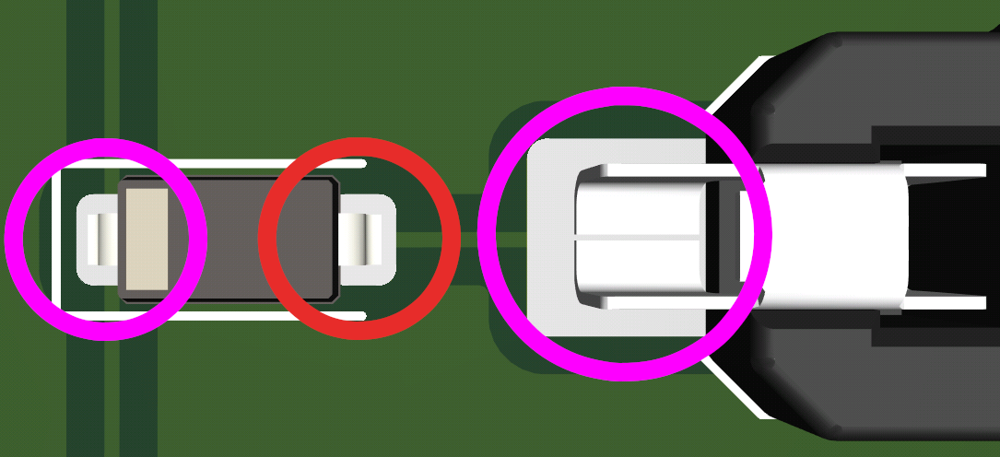

import Tabs from "@theme/Tabs";
import TabItem from "@theme/TabItem";

export const TesterTabs = (props) => (
    <Tabs
    groupId="testers"
    defaultValue="promicro"
    values={[
      { label: "Pro Micro Compatible Board", value: "promicro" },
      { label: "Seeed Studio XIAO Compatible Board", value: "xiao" },
    ]}
  >
    {/* eslint-disable-next-line */}
    {props.children}
  </Tabs>

);

export const PinTabs = (props) => (
    <Tabs
    groupId="pin-approaches"
    defaultValue="shield"
    values={[
      { label: "Tester Shield", value: "shield" },
      { label: "Multimeter", value: "multimeter" },
      { label: "Visual Inspection", value: "visual" },
    ]}
  >
    {/* eslint-disable-next-line */}
    {props.children}
  </Tabs>

);

:::warning
This page contains _general and non-comprehensive advice_ for troubleshooting hardware issues.
ZMK is a _firmware_ project, not hardware.
Your first move should always be to reach out to the product's vendor or manufacturer.

ZMK contributors cannot provide official support for hardware products they did not create, though the wider community may be able to help as a last resort.
:::

## Electrical Net Connections

Problems with your electrical net can manifest in a number of ways. The most common way is through one or more keyswitches not working, often an entire row or column. If this is the case, then (assuming you have access to it) you could use your keyboard's schematic to help identify which pins you need to check.

### Identifying Issues

There are three general approaches we recommend for identifying potential issues with the electrical net (pins & connections between components) of your device.

<PinTabs>
<TabItem value="shield">
ZMK's main repository currently has "tester" shields for [Pro Micro](https://cdn.sparkfun.com/assets/9/c/3/c/4/523a1765757b7f5c6e8b4567.png) and [Seeed Studio XIAO](https://files.seeedstudio.com/wiki/Seeeduino-XIAO/img/Seeeduino-XIAO-pinout-1.jpg) compatible boards. These will help you test your GPIO pins, but cannot be used to troubleshoot power pins.
#### Acquiring tester firmware

<TesterTabs>
<TabItem value="promicro">
Find the `build.yaml` file in your `zmk-config` folder and add an additional `tester_pro_micro` build for your board:

```yml title="build.yaml"
include:
  # -------------------
  # Your keyboards here
  # -------------------
  - board: nice_nano_v2 # Replace with the Pro Micro-compatible board you're using
    shield: tester_pro_micro
```

Save the file, commit the changes and push them to GitHub. Download the new firmware zip file build by the latest GitHub Actions job. In it you will find an additional `tester_pro_micro` UF2 image file. Flash this file to your board.

The pinout of the pro micro interconnect is shown below:


</TabItem>
<TabItem value="xiao">
Find the `build.yaml` file in your `zmk-config` folder and add an additional `tester_xiao` build for your board:

```yml title="build.yaml"
include:
  # -------------------
  # Your keyboards here
  # -------------------
  - board: seeeduino_xiao_ble # Replace with the Xiao-compatible board you're using
    shield: tester_xiao
```

Save the file, commit the changes and push them to GitHub. Download the new firmware zip file build by the latest GitHub Actions job. In it you will find an additional `tester_xiao` UF2 image file. Flash this file to your board.

The pinout of the seeeduino xiao interconnect is shown below:


</TabItem>
</TesterTabs>
:::danger
Do not short a positive voltage pin (5V, RAW, 3V3, VCC, Battery+ aka B+) to ground or GPIO pins when using the tester. Doing so may permanently damage your device or even cause battery fires.
:::

After flashing, open a text editor of your choice. Shorting a GPIO pin to ground (with e.g. a wire or tweezers, hold one end go ground and tap the pin with the other end) will now trigger the keyboard to send an informative message on which pins were triggered.

- If one pin was triggered, then the pin is working fine.
- If two were triggered at once, then these pins are shorted together on your device.
- If no pin was triggered, try shorting a working pin to the pin you were trying to trigger to test if it is shorted to ground on your device. Otherwise, the pin is disconnected or broken.

Once you have identified _which_ pins have issues, if any, it is recommended that you resort to visual inspection or trial and error with this shield/a multimeter to identify where the faulty connection is.

</TabItem>
<TabItem value="multimeter">
A multimeter is the most reliable tool for troubleshooting hardware issues. If you're not familiar with how to use one or just need a refresher, consider reading through SparkFun's [*How to Use a Multimeter*](https://learn.sparkfun.com/tutorials/how-to-use-a-multimeter) tutorial.

Here is a checklist for you to use while probing your device with the multimeter:

- Are any of the pins shorted that shouldn't be shorted?
- Are all the diodes/components working and in the correct orientation?
- Does pressing a keyswitch close the affected circuit?
- When the device is plugged in, are all the pins at the expected voltage? (Typically ground or 3V3, which is where depends on the design and firmware)
- Are there any failed solder joints?

Do note that as you need to have access to both sides of a connection, you cannot use a multimeter to troubleshoot pins which are underneath a chip. If the chip in question is your MCU, then you should use a tester shield instead.

:::tip
To check a solder joint, it is best to probe the two points either side of it if you can.

<details>
<summary>Example</summary>



To check if the joint marked in red is faulty, measure [the forward voltage drop](https://www.fluke.com/en-us/learn/blog/digital-multimeters/how-to-test-diodes) of the diode, then take the same measurement between the joints circled in purple. If you get the same results as probing the diode directly, there is no problem with the joint.

</details>
:::

</TabItem>
<TabItem value="visual">
Visual inspection is generally less reliable, but a lot easier than either of the other approaches. Generally, you want to be looking for solder bridges, exposed copper, broken PCB traces, lifted pads, and similar artifacts.

For through-hole soldering specifically, the below infographic can be quite helpful.


To confirm that something you've identified is indeed a problem, you'll want to make use of a multimeter or our tester shield.
:::tip
The above image was taken from [Sparkfun's guide on soldering through-hole components](https://learn.sparkfun.com/tutorials/how-to-solder-through-hole-soldering), which may be of use if you are less experienced with soldering.
:::

</TabItem>
</PinTabs>

### Resolving Issues

Many issues can be resolved by reworking the affected solder joints (Look up a tutorial on how to do so for your component). Sometimes a pin ends up broken though, in which case you will need to "bodge" (solder) a wire from a spare GPIO pin to the connection in need of a working pin.

Once you have done so, you will need to adjust the `kscan` of your keyboard slightly. The recommended approach to doing so is via your `zmk-config`:

1. Search through the files defining your board/shield for the definition of the keyboard's `kscan`. This is typically a `.dts`, `.dtsi`, or an `.overlay` file.
2. Add a [phandle](https://docs.zephyrproject.org/latest/build/dts/phandles.html) to your `.keymap` pointing at your `kscan`, copying in the property of your `kscan` where the broken GPIO pin appears. Depending on your `kscan` driver this could be `input-gpios`, `row-gpios`, etc. If you are using a [split keyboard](../features/split-keyboards.md) and the issue is only affecting one part, you'll need to create separate keymap files for each part (`keyboard_left.keymap` and `keyboard_right.keymap`, for example), removing the shared one, and only edit the affected one.
3. Edit the node to replace the old GPIO key with the new. For example:

```dts
&kscan0 {
    input-gpios
        = <&pro_micro 7 (GPIO_ACTIVE_LOW | GPIO_PULL_UP)>
        , <&pro_micro 6 (GPIO_ACTIVE_LOW | GPIO_PULL_UP)>
        , <&pro_micro 9 (GPIO_ACTIVE_LOW | GPIO_PULL_UP)>
        ;
};
```

could have the pin `&pro_micro 6` (D6 in the [Pro Micro pinout](../development/hardware-integration/new-shield.mdx#shield-overlays)) replaced with `&gpio0 8` (P0.08 for nRF MCUs).

```dts title="<my_keyboard>.keymap"
&kscan0 {
    input-gpios
        = <&pro_micro 7 (GPIO_ACTIVE_LOW | GPIO_PULL_UP)>
        , <&gpio0 8 (GPIO_ACTIVE_LOW | GPIO_PULL_UP)>
        , <&pro_micro 9 (GPIO_ACTIVE_LOW | GPIO_PULL_UP)>
        ;
};
```

You can then build and flash using your config as usual.

:::note
If the affected pin is not in your `kscan`, you will want to copy over and overwrite the node that it is in instead.
:::

## Hardware-Related Wireless Connectivity Issues

Under ideal conditions, a Bluetooth connection can be stable at even a 100 meter distance. However, there are many things which can affect the effective range of the antenna. In no particular order, the most common issues you will encounter are:

- Solid material near an antenna or between the two communicating antennas (metal is _particularly_ bad)
- Interference from other nearby 2.4GHz connections
- The antenna makes use of malfunctioning hardware such as a [faulty oscillator](connection-issues.mdx#mitigating-a-faulty-oscillator)
- Not enough [power being provided to the antenna](connection-issues.mdx#unreliableweak-connection)
- A missing external antenna for motherboard-integrated or PCIe wireless adapters
- Interference from [USB 3 devices](https://www.bluetoothandusb3.com/the-explanation)
- Keyboard design flaws, including
  - Using low frequency nRF52840 pins for high frequency purposes such as WS2812 RGB LEDs
  - Improperly tuned antenna

It is expected that your antenna will have some interference -- hence why most household devices using Bluetooth have an effective range of 5-10 meters.

### Identifying & Resolving Issues

Troubleshooting wireless connectivity issues caused by hardware can only really be done via trial and error.

A good initial approach is:

1. Make sure you have firmware flashed to your device that has BLE enabled, with at least one [Bluetooth profile](../features/bluetooth.md#profiles) free and no uncleared profiles previously paired to the host device.
2. Select the free profile.
3. Remove as many physical objects between your ZMK device and a host device as possible.
4. Switch off as many other nearby wireless devices as possible.
5. Hold the antenna as close to the host's antenna as possible, minimizing material near the ZMK antenna and between the two antennas.

If your host cannot find the ZMK device under these conditions, then your antenna likely has a more significant problem and you should contact your vendor, manufacturer, or designer.

If your host _can_ find the ZMK device, then you can narrow down the solution to one or more of the points above. The previously linked documentation sections may be of use for that.
