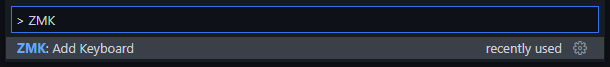
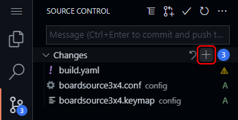
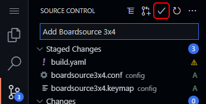

import Tabs from '@theme/Tabs';
import TabItem from '@theme/TabItem';

Unlike other keyboard firmwares, ZMK Firmware has been built from the ground up to allow users to manage
their own keyboard configurations, including keymaps, specific hardware details, etc. all outside of the
core ZMK Firmware source repository.

In addition to this, most users will not need to install any complicated toolchains or tools to build ZMK. GitHub Actions is used instead to automatically build the user's configured firmware for them.

## Summary

The following steps can be taken to obtain an installable firmware image for your device, without the need
to install any compiler or specialized toolchain. This is possible by leveraging [GitHub Actions](https://github.com/features/actions)
to build your firmware for you in the cloud, which you can then download and flash to your device.

Following the steps in this guide, you will:

1. Create a new repository in GitHub that will contain your user config.
1. Run an automated tool which will prompt you for a keyboard (e.g. Lily58 or Kyria) and MCU board (e.g. nice!nano) and add the necessary files to your repository.
1. Change your keymap and/or configuration files to enable/disable optional ZMK features.
1. Commit and push the updates to trigger a new Github Action to run.

## GitHub Repo

Before running the setup tool, you will first need to create a new GitHub repository to host the config.

1. Create a [GitHub](https://github.com/) account if necessary and log in.
1. Navigate to [https://github.com/zmkfirmware/unified-zmk-config-template](https://github.com/zmkfirmware/unified-zmk-config-template).
1. Click "Use this template".
1. Enter a repository name, for example `zmk-config`. You may also make the repository private if you like.
1. Click "Create repository from template".
1. Keep this browser tab open. You will need the repository URL in a later step.

## User Config Setup

There are two ways to quickly set up your user config repository:

1. In a web browser using [github.dev](https://github.dev/).
1. On your PC by downloading and running a Python script. This option requires more work to set up, but you can use your text editor of choice to edit keymaps.

<Tabs
defaultValue="browser"
values={[
{label: "Web Browser Setup", value: "browser"},
{label: "Local Setup", value: "local"},
]}>
<TabItem value="browser">

In your web browser, go to your repository's page on GitHub and press the `.` (period) key or swap `.com` for `.dev` in the URL to open it in a web-based instance of Visual Studio Code.

Next, press `Ctrl+P`, paste the following command in the command palette that appears at the top, and press `Enter` to install the ZMK Tools extension.

```
ext install spadin.zmk-tools
```

### Keyboard Selection (Browser)

With the extension installed, press `Ctrl+Shift+P` and run the `ZMK: Add Keyboard` command from the command palette.



When prompted, select your keyboard from the list. If your keyboard requires a controller, you will be prompted to select that as well.


The extension will copy the necessary files to the `config` directory in your repository, update the GitHub Actions file, and open the keymap for editing.

:::note
If you are building firmware for a new keyboard that is not included in the built-in list, see the [guide for adding a new keyboard shield](development/new-shield.md) instead.
:::

### Committing and Pushing Changes (Browser)

Your changes are not saved to GitHub until you commit and push them. To do this:

1. Press `Ctrl+Shift+G` or click the "Source Control" tab on the left to see a list of pending changes.
1. Hover your mouse over "Changes" above the list of changed files and click the `+` (Stage All Changes) button on the right.

   

1. Type a description of the change in the "Message" box.
1. Click the `✓` (Commit and Push) button at the top.

   

</TabItem>
<TabItem value="local">

Local setup requires the following prerequisites:

1. You have installed and configured the [Git](https://git-scm.com/) version control tool.
1. You have configured Git to access your GitHub account. If using [personal access tokens](https://docs.github.com/en/free-pro-team@latest/github/authenticating-to-github/creating-a-personal-access-token), please be sure it was created with the "workflow" scope option selected.
1. Python is installed.

Python is typically installed by default on Linux and macOS. For Windows, you can [install it from the Microsoft Store](https://www.microsoft.com/store/productId/9PJPW5LDXLZ5), or you can find install instructions for all OSes on [the Python website](https://www.python.org/downloads/).

:::note
If you need to, a quick read of [Learn The Basics Of Git In Under 10 Minutes](https://www.freecodecamp.org/news/learn-the-basics-of-git-in-under-10-minutes-da548267cc91/) will help you get started with Git.
:::

Next, download the ZMK setup script by opening a terminal window and running the following command. On Windows, use [Windows Terminal](https://www.microsoft.com/store/productId/9N0DX20HK701), Command Prompt, or PowerShell.

```sh
pip3 install --user --upgrade zmk.setup
```

Run the following command to start the the setup script. If this does not work, try replacing `python3` with `python`.

```sh
python3 -m zmk.setup
```

The script will now ask you for your repository's URL. In your web browser, go to your repository's page and click the green "Code" button. Copy the URL shown there and paste it into the terminal (depending on the terminal used, this may be done with `Ctrl+V`, `Ctrl+Shift+V`, or right click). Press `Enter` and the script will clone the repository to your PC in a directory named after the repo name.

```
Next, go to your repo page on GitHub and click the "Code" button. Copy the
repo URL and paste it here (Ctrl+Shift+V or right click).

Repo URL: https://github.com/petejohanson/zmk-config.git
```

:::note
If you are using SSH keys for Git authentication, change to the SSH tab and paste that instead, e.g. `git@github.com:petejohanson/zmk-config.git`.
:::

### Keyboard Selection (Local)

When prompted, select your keyboard from the list using the arrow keys and press `Enter`. If your keyboard requires a controller, you will be prompted to select that as well.

```
Pick a keyboard:
> 2% Milk
  A. Dux
  BAT43
  BDN9 Rev2
  BFO-9000
```

:::note
If you are building firmware for a new keyboard that is not included in the built-in list, you can choose any keyboard from the list that is similar to yours to generate the repository, then edit or add necessary files according to the [guide for adding a new keyboard shield](development/new-shield.md).
:::

### Confirming Selections (Local)

The setup script will confirm all of your selections one last time before making changes to the repository:

```
Adding the following to your user config repo:
- Shield:       Kyria  (kyria_left kyria_right)
- MCU Board:    nice!nano v2  (nice_nano_v2)
- Repo URL:     https://github.com/petejohanson/zmk-config.git

Continue?
> Yes
  No
```

After selecting "Yes" and pressing `Enter`, the script will copy the necessary files to the `config` directory in your repository, update the GitHub Action YAML file, make a commit, and then push it to GitHub.

:::note
If you used the default GitHub repo URL using the `https://` scheme, you may be prompted for your username + password in order to push the initial commit.
:::

You can now edit the keymap and configuration files in your text editor of choice.

### Committing and Pushing Changes (Local)

The setup script will automatically commit and push changes to add new keyboards. However, if you edit keymap or configuration files, your changes are not saved to GitHub until you commit and push them. To do this, use the `cd` command to navigate to the repository, then run the following commands:

```sh
git add .
git commit -m "Type a description of the change here"
git push
```

### Adding More Keyboards (Local)

To add another keyboard to the same repository, use the `cd` command to navigate to the repository and run the setup script again. The script will recognize that you are already in a ZMK user config repository, so you will not need to clone it again.

</TabItem>
</Tabs>

## Installing the Firmware

### Downloading the Archive

Every time you push a change to your user config repository, GitHub will automatically run the action to build your keyboard firmware files. You can view the actions by clicking on the "Actions" tab on your GitHub repository.


Once you have loaded the Actions tab, select the top build from the list. Once you load it, the right side panel will include
a link to download the `firmware` upload:


Download and extract the zip archive. It should contain one or more `.uf2` or `.bin` files.

### Flashing Firmware

You will use a different process for flashing depending on the type of files in the firmware archive.

<Tabs
defaultValue="uf2"
values={[
{label: "UF2 Files", value: "uf2"},
{label: "Bin Files", value: "bin"},
]}>
<TabItem value="uf2">

To flash UF2 firmware, first connect your keyboard to your PC with a USB cable and put it into bootloader mode by double clicking the reset button (either on the MCU board itself, or the one that is part of your keyboard). The controller should appear in your OS as a new USB storage device.

Once this happens, copy the correct UF2 file (e.g. left or right if working on a split), and paste it onto the root of that USB mass storage device. Once the flash is complete, the controller should automatically restart and run your newly flashed firmware.

:::note
There is a known issue with the Adafruit nrf52 bootloader where it may reboot into the new firmware before reporting the copy as complete. If your OS says the copy failed, it usually does not mean the firmware failed to flash.
:::

</TabItem>
<TabItem value="bin">

If your firmware archive only contains `.bin` files, your controller likely uses DFU to update firmware. [QMK Toolbox](https://github.com/qmk/qmk_toolbox) is an easy to use flashing tool which supports DFU.

Grab the latest version for your OS from the [releases page](https://github.com/qmk/qmk_toolbox/releases) and run the application. Drag and drop the correct Bin file (e.g. left or right if working on a split) onto the window, or click the "Open" button and select the file to flash.

Connect your keyboard to your PC with a USB cable, and check the log window at the bottom to see if QMK Toolbox has detected your keyboard. If not, you may need to put the keyboard into a bootloader or DFU mode. Consult the documentation for your keyboard or MCU board for how to do this. It is typically done with a dedicated "bootloader" button, by pressing a combination of buttons, or by double clicking or holding a reset button.

Once your keyboard is detected, press the "Flash" button to flash the new firmware.

</TabItem>
</Tabs>

## Wirelessly Connecting Your Keyboard

ZMK will automatically advertise itself as connectable if it is not currently connected to a device. You should be able to see your keyboard from the bluetooth scanning view of your laptop or phone / tablet. It is reported by some users that the connections with Android / iOS devices are generally smoother than with laptops, so if you have trouble connecting, you could try to connect from your phone or tablet first to eliminate any potential hardware issues.

ZMK supports multiple BLE “profiles”, which allows you to connect to and switch among multiple devices. Please refer to the [Bluetooth behavior](behaviors/bluetooth.md) section for detailed explanations on how to use them.

### Connecting Split Keyboard Halves

For split keyboards, after flashing each half individually you can connect them together by resetting them at the same time. Within a few seconds of resetting, both halves should automatically connect to each other.
